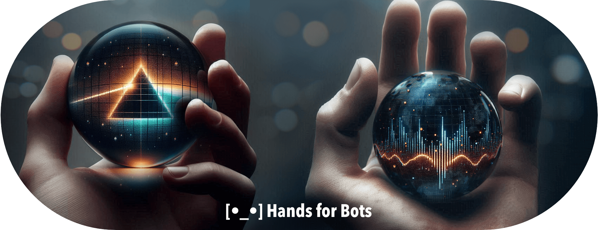

 &nbsp;  &nbsp; 

 &nbsp;  &nbsp; 

😩  😥

For now the **Hands for Bots** is a hybrid conversational UI library for browsers. This means that graphic, sound and other inputs and outputs can be present. It gives to chatbots / assistants the hability to interact with GUI and other user interfaces through functions calling, and receive inputs from diferent UIs.

Hands for Bots uses a modular archtecture based on plugins to grant a high level of flexibility, modularity and extensibility to build chatbot's front end. Event triggers and listeners connects the core to plugins. To call external functions, we should call the function directly, this not depends on the internal architecture.

**Important:** this library don't give to assistants the hability to "view" the screen and do things in your computer.

## Table of contents

- [Get started](./docs/getstarted.md)
- [Development](./docs/development.md)

## Acknowledgment

Grateful for the authors of [these third-party libraries and frameworks](./NOTICE.md)

## Roadmap

There is an intention to improve the quality of the Hands for Bots' code and develop ready-to-use features for virtual reality and conversational applications, perhaps even in wearable technologies. That's a long way off, but let's get it.

