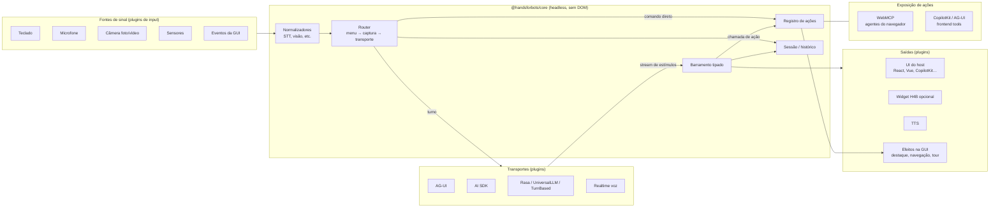

# Hands for Bots — Roadmap v2

**Horizonte:** 6–9 meses
**Última atualização:** outubro/2026

Este documento substitui o roadmap de julho/2026. Ele redefine o posicionamento do Hands for Bots (H4B), descreve a arquitetura da v2 (tudo é plugin), mostra onde cada recurso atual se encaixa e ordena o trabalho em fases com critérios de saída.

**Sem compatibilidade com a v1:** não há implantações relevantes da v1, então a v2 é uma reescrita livre. A v1 só fica no repositório até os exemplos rodarem na v2; depois é removida.

**Relacionados:**

- [README](./README.md) — visão geral
- [Documentação da v2](./docs/pt-br/README.md) — primeiros passos, conceitos, plugins (a v1 e sua documentação saíram do repositório; ficam no histórico do git)
- [Observability roadmap (HfB)](./packages/semantic-event-observability/docs/handsforbots-roadmap.md) — métricas e traces

---

## 1. Tese

O H4B nunca foi pensado como janela de chat. Ele nasceu para dar "mãos" a bots: criar uma experiência de **trabalho colaborativo** entre pessoa e assistente sobre a própria GUI, e permitir que os chatbots da época respondessem com **mais do que texto** (agir na interface, guiar o usuário, mostrar conteúdo, falar). A janela de texto da v1 era só um dos canais.

Em 2026 essa ideia virou necessidade de mercado. Hoje existem assistentes dentro dos apps (CopilotKit, AI SDK, assistant-ui), agentes de navegador que operam sites (via WebMCP) e servidores que entregam UI aos clientes (MCP Apps). O que mudou é que a conversa em si virou commodity: threads, composers e streaming de texto já estão bem resolvidos por essas libs. O espaço que continua aberto é justamente o original do H4B: a colaboração na GUI, as respostas ricas e as entradas além do teclado.

**Posicionamento v2:**

> O H4B é a camada multimodal e de ação entre o usuário, a GUI e qualquer agente. Qualquer entrada (teclado, voz, foto, vídeo, sensores, eventos da GUI) vira um sinal. Qualquer backend responde com mensagens e/ou estímulos para a UI. As ações do app são declaradas uma vez e ficam disponíveis para o assistente do app, para agentes do navegador e para comandos diretos do usuário.

### Quando alguém escolhe o H4B em vez de gerar o código com IA

Código gerado é barato de escrever e caro de manter. O H4B se justifica onde o difícil é **manter**:

| Problema | Por que uma lib vence código gerado |
|----------|-------------------------------------|
| Voz de verdade (STT/TTS, barge-in, VAD, fallback navegador ↔ nuvem) | Quirks de navegador, permissões, eco, mobile; muda a cada versão de browser |
| Specs em movimento (AG-UI, WebMCP, MCP Apps) | O WebMCP mudou de API duas vezes em 2026; a lib absorve a mudança uma vez para todos |
| Segurança de ações (o LLM ou um agente externo acionando a GUI) | Allowlist, schema, confirmação e nível de confiança por origem: fácil de errar, caro de auditar |
| Menu / comandos diretos com histórico coerente | Exige integração entre roteamento, histórico e contexto do LLM |
| Troca de fornecedor (LLM, framework de agente, provedor de voz) | Contratos estáveis e adapters testados por suíte de conformidade |

### Relação com AG-UI, CopilotKit e afins

O H4B **não compete** com eles: ele se conecta a eles. A regra de arquitetura é:

> **O H4B tem seu próprio modelo interno. Cada ferramenta externa entra como adapter.** Trocar CopilotKit por assistant-ui, ou AG-UI pelo AI SDK, é trocar um plugin, não reescrever o app.

AG-UI e CopilotKit são os alvos **prioritários** porque são o padrão mais adotado hoje, mas não são dependências do core.

---

## 2. Arquitetura v2

### 2.1 Visão geral



### 2.2 Modelo de dados: Sinal → Turno → Estímulo

Tudo o que entra é um **Sinal**; tudo o que volta é um **stream de Estímulos**. Com esse contrato único, "qualquer entrada → qualquer backend → qualquer reação" fica possível sem casos especiais.

**Sinal** (entrada):

```ts
type Signal = {
  id: string
  kind: 'trigger' | 'context'      // inicia um turno, ou só anexa contexto ao próximo
  modality: 'text' | 'audio' | 'transcript' | 'image' | 'video' | 'sensor' | 'gui-event' | 'command'
  parts: Part[]                    // texto, blob, frame, leitura de sensor, payload de evento
  source: string                   // plugin de origem, ex. 'input-keyboard', 'sensor-geolocation'
  meta?: Record<string, unknown>   // idioma, confiança do STT, dispositivo…
}
```

- `trigger` inicia um turno (mensagem digitada, fala finalizada, foto enviada, Poke da GUI).
- `context` não inicia turno: fica anexado ao próximo (rota atual, item selecionado, localização, últimas leituras de sensor). Isso substitui o uso "proativo" do Poke quando não é preciso resposta.

**Estímulo** (saída, sempre em stream; backend síncrono = stream de 1 evento):

| Tipo | Uso | Equivalente AG-UI |
|------|-----|-------------------|
| `message.start / delta / end` | Texto progressivo | `TEXT_MESSAGE_*` |
| `audio` | Áudio pronto ou em stream (realtime) | `CUSTOM` |
| `action.call` | Pedido para executar ação registrada | `TOOL_CALL_*` |
| `ui.render` | Componente do host ou MCP App em um slot | `CUSTOM` / tool result com UI |
| `ui.effect` | Destacar, rolar, navegar, tour, som, vibração | `CUSTOM` |
| `state.patch` | Estado compartilhado app ↔ agente | `STATE_DELTA` / `STATE_SNAPSHOT` |
| `turn.end / error` | Fim do turno | `RUN_FINISHED` / `RUN_ERROR` |

O modelo interno é próximo do AG-UI de propósito, para que o adapter seja fino, mas é do H4B: se o AG-UI mudar ou for substituído, só o adapter muda.

### 2.3 Kernel e plugins

O kernel é pequeno: contexto, barramento tipado, ciclo de vida de plugins, registro de serviços, router, ações e sessão. **Todo o resto é plugin**, inclusive transporte, voz, UI e telemetria.

**Formato de plugin** (inspirado no DeepSeek Harness / Cordis):

```ts
import { definePlugin } from '@handsforbots/core'

export default definePlugin({
  name: 'stt-webspeech',
  apiVersion: 2,
  provides: ['stt'],             // serviço com chave estável no contexto
  inject: ['signals'],           // espera estas dependências antes de aplicar
  config: Schema,                // Standard Schema (Zod, Valibot, ArkType…)
  apply(ctx, config) {
    ctx.provide('stt', new WebSpeechSTT(config))
    ctx.on('voice.listen', () => { /* … */ })        // removido automaticamente no unmount
    ctx.effect(() => {                                // recursos com descarte explícito
      const id = setInterval(tick, 1000)
      return () => clearInterval(id)
    })
  },
})
```

**Composição no app host:**

```ts
import { createH4B } from '@handsforbots/core'
import { agui } from '@handsforbots/transport-agui'
import { keyboard } from '@handsforbots/input-keyboard'
import { voice, webSpeechSTT, cloudSTT, webSpeechTTS } from '@handsforbots/voice'
import { menu } from '@handsforbots/menu'
import { webmcp } from '@handsforbots/expose-webmcp'

const h4b = createH4B({
  plugins: [
    agui({ url: '/api/agent' }),
    keyboard(),
    voice({
      stt: [cloudSTT({ tokenUrl: '/api/stt-token' }), webSpeechSTT()], // ordem = preferência + fallback
      tts: webSpeechTTS(),
    }),
    menu(),
    webmcp(),
  ],
})

h4b.actions.register({
  name: 'filter_orders',
  description: 'Filtra a lista de pedidos por período',
  input: FilterSchema,
  handler: ({ from, to }) => ordersStore.filter(from, to),
  confirm: 'never',                       // 'never' | 'destructive' | 'always'
  exposeTo: ['assistant', 'menu', 'webmcp'],
})
```

**O que aproveitamos do DeepSeek Harness e o que não aproveitamos:**

| Aproveitamos | Não aproveitamos |
|--------------|------------------|
| "Tudo é plugin", inclusive o loop e o transporte | Gerenciamento de plugins pelo backend (`settings.yaml`, console web) |
| Plugin = `name` + `inject` + `config` + `apply(ctx)` | Instalar ou carregar código em runtime: no navegador isso conflita com CSP, bundlers e segurança |
| Serviços com chave estável no contexto (`ctx.stt`, `ctx.transport`) | Kernel acoplado a Node |
| Registros feitos pelo `ctx` são desfeitos no unmount do plugin | |
| Montar e desmontar em runtime (ex.: carregar voz só quando o usuário ativa o microfone) | |

No H4B os plugins são **módulos ESM / pacotes npm compostos em código**, compatíveis com tree-shaking e qualquer bundler. Um plugin opcional `remote-config` pode ligar, desligar e configurar plugins **já incluídos no bundle**, mas nunca baixar código.

**Ecossistema:**

- Oficiais: `@handsforbots/<nome>`.
- Comunidade: `h4b-plugin-<nome>` + tópico `h4b-plugin` no GitHub.
- `apiVersion` no plugin; o kernel recusa versões incompatíveis com erro claro.
- Suíte de conformidade publicada (`@handsforbots/testkit`) para transportes, provedores de voz e plugins de exposição.

### 2.4 Síncrono e assíncrono

Na v1 tudo era evento, e não havia distinção entre "avisar que algo aconteceu" e "esperar alguém decidir". Na v2 são quatro mecanismos, e **todos aceitam funções síncronas ou assíncronas**:

| Mecanismo | Para quê | O fluxo espera? | Exemplo |
|-----------|----------|-----------------|---------|
| **Notificação** (`on` / `emit`) | Observar: UI, telemetria, sincronizar abas | Não. Listener lento ou com erro não afeta o turno; rejeições vão para `onError` | `h4b.on('stimulus', render)` |
| **Interceptador** (`intercept`) | Transformar ou vetar: filtrar PII, bloquear ação, descartar estímulo | Sim. Rodam em ordem de prioridade; retornar `null` descarta/cancela | `ctx.intercept('request.before', redact)` |
| **Contrato de serviço** | Fazer o trabalho: transporte, ações, matchers, storage, confirmação | Sim, cada chamada é aguardada | `handler: async (args) => api.save(args)` |
| **API aguardável do host** | Usar o H4B como chamada: "pergunte e me dê a resposta" | Sim | `const { messages } = await h4b.ask('…')` |

Pontos de interceptação: `signal.before`, `request.before`, `action.before` (vale para qualquer origem: assistente, menu ou agente externo) e `stimulus.before`. Pacotes podem declarar novos.

**Do lado do backend**, as três formas de resposta usam o mesmo stream de estímulos:

- **Síncrono** (REST request/response, ex.: Rasa): o transporte devolve um stream de um lote só.
- **Streaming** (SSE, AG-UI): o stream entrega estímulos conforme chegam.
- **Fora de turno** (WebSocket, jobs longos, mensagens proativas): o transporte implementa `connect()` ou o host chama `h4b.push(stimuli)`. Os estímulos entram na mesma fila dos turnos, então a ordem é preservada.

Turnos são processados um por vez, em ordem de chegada. `h4b.abort()` cancela o turno atual (barge-in), e todo transporte e ação recebe um `AbortSignal`.

### 2.5 Router: menu, captura e transporte

Todo sinal `trigger` passa pelo router nesta ordem:

1. **Menu** (comando direto): se um comando reconhece o sinal com confiança suficiente, executa a ação sem LLM.
2. **Captura**: um plugin pode pegar temporariamente a entrada (ex.: o GUIDed durante um tour). Substitui o `core.redirect_input` da v1, agora com prazo e liberação explícita.
3. **Transporte**: o turno vai ao backend configurado.

### 2.6 Menu: comandos sem LLM, dentro do histórico

**Objetivo:** executar ações frequentes e previsíveis imediatamente ("mostrar pedidos de março", "/ajuda", botão de resposta rápida, item da paleta de comandos) sem passar pelo LLM, e manter tudo isso no histórico.

**Como um comando é reconhecido** (matchers são plugins, em ordem de custo):

| Matcher | Exemplo | Custo |
|---------|---------|-------|
| Explícito | `/pedidos março`, botão, quick reply, paleta (Ctrl+K) | Zero ambiguidade |
| Padrão / gramática | Regex ou gramática por idioma: "mostrar pedidos de {mês}" | Determinístico |
| Fuzzy léxico | Frases curtas por idioma, tolerando erros de digitação e de transcrição ("porximo" → "próximo"). Evolução do Fuse.js usado no GUIDed da v1 | Determinístico, com score; frases longas vão ao LLM |
| Semântico local (opcional) | Embeddings pequenos no navegador, para paráfrases ("me mostra o que falta pagar"), com limiar de confiança | Probabilístico; abaixo do limiar vai ao LLM |

Um comando do menu sempre aciona uma **ação do registro**. A mesma ação pode ser chamada pelo LLM (tool call), por um agente do navegador (WebMCP) ou pelo usuário (menu): **uma ação, três gatilhos**.

**Histórico:** o comando direto é gravado como um turno com `route: 'direct'`:

- o sinal original do usuário;
- uma **tool call sintética + resultado** da ação;
- a confirmação curta exibida ao usuário.

No turno seguinte, o transporte envia esse trecho como se o próprio modelo tivesse chamado a ferramenta. Os modelos já entendem esse formato nativamente, então o LLM continua a conversa sabendo o que aconteceu.

**Experiência: diferença de latência sem estranhamento**

O risco é o usuário perceber o assistente às vezes instantâneo, às vezes lento, sem entender por quê. As regras:

1. **Mesma gramática visual nas duas rotas.** Toda resposta passa pelo mesmo renderizador de estímulos, com os mesmos estados (`recebido → agindo → pronto`) e os mesmos componentes (bolha, cartão de ação).
2. **Confirmação imediata em qualquer rota (< 100 ms).** Eco do que o usuário pediu e estado "agindo". O LLM nunca deixa a tela parada; o menu nunca "pula" a etapa.
3. **Tornar a causa da rapidez visível.** Comandos diretos têm um selo discreto (ex.: "⚡ ação direta") e aparecem como sugestão enquanto o usuário digita ou fala. Rapidez com motivo visível parece intencional; sem motivo, parece inconsistência.
4. **Duração mínima de transição (~250–400 ms) para evitar piscar.** Não é atraso artificial na ação: a ação executa na hora; só a animação de estado respeita um mínimo.
5. **Voz:** confirmação falada curta ("Pronto, filtrei março") e um som de confirmação (earcon) consistente nas duas rotas.
6. **Desfazer** para ações diretas, e confirmação para ações destrutivas, independente da rota.
7. **Comentário do LLM em segundo plano (opcional, desligado por padrão):** após a ação direta, o LLM pode acrescentar um comentário sem bloquear a UI.
8. **Medir.** Telemetria de latência percebida por rota (`direct` vs `transport`) para calibrar limiares e animações.

### 2.7 Modalidades: teclado e microfone em pé de igualdade

Um **gerenciador de modalidades** (no kernel) decide como o usuário interage em cada momento e permite trocar a qualquer instante.

**Modos de entrada:**

| Modo | Quando faz sentido |
|------|--------------------|
| `keyboard` | Escritório, ambiente silencioso, privacidade, sem permissão de microfone |
| `push-to-talk` | Mobile, ambiente com ruído, controle explícito (botão ou tecla segurada) |
| `hands-free` | Mãos ocupadas, acessibilidade; VAD + cancelamento de eco, com barge-in |

**Regras:**

- **A saída segue a entrada por padrão:** se o usuário falou, a resposta é falada e exibida; se digitou, só texto. Configurável e sobrescrevível pelo usuário.
- **Seleção automática com override:** sem suporte ou sem permissão → teclado; preferência salva por usuário; dicas do host (ex.: "modo carro").
- **Barge-in:** em `hands-free`, voz detectada durante o TTS interrompe a fala (evolução do `ignore/unignore` da v1).
- **Teclado é cidadão de primeira classe:** atalhos configuráveis, paleta de comandos compartilhada com o menu, ARIA live regions para respostas em stream, foco gerenciado.

**Provedores de voz plugáveis** (navegador ou nuvem):

| Serviço | Provedores previstos |
|---------|---------------------|
| `stt` | Web Speech API do navegador, Vosk WASM (offline), Vosk remoto (WebSocket), nuvem (adapter genérico + 1–2 provedores de referência) |
| `tts` | `speechSynthesis` do navegador, nuvem (adapter genérico) |
| `realtime` | Modelos speech-to-speech (OpenAI Realtime, Gemini Live etc.) como **transporte** que dispensa STT/TTS |

- Cada provedor declara capacidades (`partials`, `offline`, `languages`, `latency`, `cost`). O gerenciador escolhe pela ordem configurada, com fallback automático.
- **Chaves de nuvem nunca ficam no navegador:** o backend emite um token efêmero (`tokenUrl`).
- Com um transporte `realtime` ativo, o áudio vai direto ao transporte; o gerenciador apenas coordena UI, barge-in e histórico (com transcrição).

### 2.8 Outras entradas: foto, vídeo, sensores, GUI

| Plugin | Sinal | Observações |
|--------|-------|-------------|
| `input-camera` | `image` (foto) / `video` (frames amostrados ou stream para transporte realtime) | Evolução do plugin Photo |
| `input-files` | `image`, `file` (PDF etc.) | Anexos no composer do host ou do widget |
| `sensor-*` | `sensor` (`context` ou `trigger` por limiar) | Geolocalização, orientação, movimento, luz, gamepad; com throttling |
| `input-gui` | `gui-event` | Evolução do Poke: cliques, formulários, navegação, inatividade |

Requisitos transversais: consentimento explícito por modalidade, indicador visível de captura ativa e um hook `beforeSend` para filtrar ou anonimizar dados antes do transporte.

### 2.9 Ações e segurança

O registro de ações substitui o `BotsCommands` (que hoje executa `window[command.action]` a partir do texto do LLM).

- Ações só existem se registradas, com schema de entrada validado.
- `confirm`: `never` | `destructive` | `always`.
- **Confiança por origem:** usuário (menu) > assistente do app > agente externo (WebMCP). Cada ação declara para quem fica exposta (`exposeTo`) e pode exigir confirmação só para algumas origens.
- Ações do histórico **não** são reexecutadas no reload; o que precisa ser restaurado vira `state.patch`.
- Limite de taxa e auditoria via telemetria.

### 2.10 Adapters externos

| Adapter | Papel | Prioridade |
|---------|-------|------------|
| `transport-agui` | Transporte padrão: envia turnos, consome eventos AG-UI | P0 |
| `bridge-copilotkit` | Duas direções: ações do H4B viram frontend tools do CopilotKit; voz, menu, sensores e WebMCP do H4B funcionam dentro de um app CopilotKit | P0 |
| `react` | Hooks finos (`useH4B`, `useAction`, `useModality`, `useStimuli`) | P0 |
| `expose-webmcp` | Publica ações em `document.modelContext` (absorve mudanças da spec) | P1 |
| `render-mcp-apps` | Renderiza `ui://` de MCP Apps em iframe com sandbox dentro de slots | P1 |
| `transport-ai-sdk` / `bridge-assistant-ui` | Alternativas ao AG-UI / CopilotKit; provam a substituibilidade | P1 |
| `transport-rasa`, `transport-universal-llm`, `transport-turn-based` | Backends existentes e APIs síncronas genéricas (ex.: Laravel) | P1 |
| `vue` | Composables (`useMessages`, `useAction`, `useContextSignal`, `useService`, `useStore`) — entregue | P2 |

**Dois modos de uso com CopilotKit:**

- **A — CopilotKit é dono do chat e da conexão com o agente.** O H4B entra só com voz, menu, sensores, ações e WebMCP via `bridge-copilotkit`.
- **B — o H4B é dono do transporte (AG-UI direto).** A UI é qualquer uma: do host, assistant-ui ou o widget do H4B.

### 2.11 Onde cada recurso da v1 se encaixa

Nada fica de fora: tudo vira plugin, serviço do kernel ou é aposentado com substituto.

| v1 | v2 | Observação |
|----|----|------------|
| `Bot.js`, `BotOrchestrator`, `EventEmitter` | Kernel (`createH4B`, barramento tipado, router) | Sem efeitos colaterais no construtor; ciclo de vida explícito |
| Core/Input/Text + `TextLayoutManager`, layouts, temas, cores | `input-keyboard` (headless) + `widget` (UI, layouts, temas) | Widget opcional |
| Core/Output/Text, `Marked`, `TextHelper`, `nl2br` | Renderizador do `widget` / componentes do host | |
| Core/Input/Voice, `SpeechRecognition`, `VoskConnector`, Vosk | `voice` + `stt-webspeech`, `stt-vosk-wasm`, `stt-vosk-remote` | Voz deixa de clicar no submit do Text: emite sinal `transcript` |
| Core/Output/Voice, `EasySpeech` | `tts-webspeech` | |
| Core/Input/Poke | `input-gui` + API `h4b.signal()` | `trigger` ou `context` |
| Core/Output/BotsCommands + action tags `[• •]` | Registro de ações + function calling | Action tags e `window[...]` removidos |
| Backend Rasa, UniversalLLM | `transport-rasa`, `transport-universal-llm` | Com streaming quando o backend suportar |
| Backend OpenAI, InsecureLocalOllama | `transport-dev-openai`, `transport-dev-ollama` | Só para desenvolvimento: chave no navegador |
| `MCPHelper` (tools via prompt + regex `<tool>`) | Ações + function calling nativo do transporte; `prompt-tools` (P2) só para modelos sem tool calling | Prompt com persona fixa é removido |
| Plugin Photo | `input-camera` | Foto + vídeo |
| Plugin GUIDed (tour, balões, `redirect_input`) | `guided`: ações `highlight`, `tour`, `explain_element` + captura no router | Agentes externos também podem guiar o usuário |
| ImageGallery, ShowRelevantContent | Componentes de `ui.render` (slots) | Descritor compatível com MCP Apps |
| HexPresentation | Plugin de apresentação do `widget` | |
| Analytics | Aposentado → sink do `observability` | |
| Observability + SemanticEventObservability | `observability` (pacote já existente) | `traceparent` no transporte |
| `SessionManager`, `BackendSessionManager`, `BotSessionAdapter`, `WebStorage`, cripto | Serviço `retention` + provedores `storage-local`, `storage-backend` | Cripto local de volta como prazo de legibilidade: chave em cookie que expira ou no backend ([ADR 0008](./docs/adr/0008-persistencia-e-abas.md)); não protege contra XSS |
| `BroadcastChannel` (sincronia entre abas) | `tab-sync` | Nome de canal por instância; modos `sync`, `notify`, `off` |
| `quick_start` | Presets: `presets.text()`, `presets.voice()`, `presets.textAndVoice()` | Só arrays de plugins |
| `language`, `disclaimer`, `presentation` | Serviço `i18n` + config do `widget` | |

---

## 3. Estado da implementação (branch `v2`, 2026-10-03, fim do dia)

| Fase | Entregue | Pendente |
|------|----------|----------|
| 0 | Decisões registradas neste documento e em [ADRs](./docs/adr/README.md); kernel próprio com semântica Cordis (0.3) | — |
| 1 | Monorepo TS (pnpm, TS 7, vitest); `core` (plugins, Sinal/Estímulo, router, ações, interceptadores, captura seletiva, `ask`/`push`/`runAction`, conteúdo rico); `transport-agui` (SSE próprio); `react`; `testkit` com suíte de conformidade de transportes | — |
| 2 | `voice` (Web Speech, HTTP, WebSocket, Vosk remoto, Vosk WASM offline; push-to-talk, segurar para falar com pausas, `cancel()` que descarta a fala, mãos-livres, saída segue entrada, barge-in); `keyboard`; `vue` | Provedor de nuvem de referência (adapter genérico pronto) |
| 3 | `menu` (explícito, padrão, fuzzy); `copilotkit` (modo A); estados unificados com duração mínima no `widget`; latência percebida por rota (`h4b_first_response_ms`) no `observability`; mensagens na fila visíveis; ponte CopilotKit validada contra o runtime real (agente self-managed) | Validar com um runtime CopilotKit remoto (CopilotRuntime) |
| 4 | `expose-webmcp`; `mcp-apps` (host de `ui://` em iframe com sandbox, validado no Chrome); `inputs` (câmera com foto e quadros de vídeo, arquivos, eventos da GUI, sensores); `ui.render` persistido + renderizadores no widget | Transporte `realtime` (fala-a-fala via WebRTC): é baseado em sessão, precisa coordenar com o plugin `voice` e devolver resultados de ações pelo data channel; fica para quando houver um provedor e uma chave para validar |
| 5 | `transport-rasa`, `transport-http` (genérico + UniversalLLM + compatível com OpenAI/Ollama), `transport-ai-sdk` (validado contra o `streamText` real), `assistant-ui` (runtime real), `widget`, `guided` (tours, destaques, `show_section`, `image_gallery`), `storage-local`, `tab-sync`, `observability`; exemplo Rasa na v2; **v1 removida**; documentação v2 (en-us / pt-br). Substituibilidade provada: AG-UI ↔ AI SDK ↔ Rasa ↔ HTTP passam na mesma suíte; CopilotKit ↔ assistant-ui ↔ widget como superfícies; exemplo Rasa validado no Docker com o Rasa real | — |

Exemplos da v2: [examples/react-agui](./examples/react-agui/README.md) e [examples/vite](./examples/README.md) (Rasa), ambos validados em Chrome headless (o Rasa simulado por interceptação de rede).

Aprendizados que ajustaram o plano:

- `@ag-ui/client` traz zod, protobuf e rxjs (o bundle do exemplo caiu de 539 kB para 257 kB com um cliente SSE próprio). O `HttpAgent` continua aceito via `agent`.
- O CopilotKit 1.77 já registra frontend tools no WebMCP (`webmcp: true`). A ponte desliga isso para o H4B ser a única fonte, com as mesmas políticas para todas as origens.
- O "comando no front" da v1 era o Fuse.js do GUIDed (fuzzy léxico, `threshold: 0.8`, sem tratar "nenhum resultado"). Virou o matcher fuzzy do `menu`, com limiar seguro.
- No tour guiado, só comandos de navegação são capturados (`capture` com `accepts`); uma pergunta no meio do tour segue para o assistente, o que a v1 não fazia.
- `tab-sync` mescla históricos por id em vez de "último a escrever vence", que perdia mensagens.
- Os exporters Langfuse/LangSmith davam precedência ao módulo importado sobre o injetado; corrigido ao mover a lib para `packages/`.

Entregue depois (2026-10-06, [ADR 0008](./docs/adr/0008-persistencia-e-abas.md)): `storage-local` criptografado por padrão, com a chave num cookie que expira (`cookieKey`) ou no backend (`backendKey`), e varredura que apaga dados sem chave ou vencidos; pacote `storage-backend`; serviço `retention` com escolhas do desenvolvedor e de quem usa o site (painel de privacidade no `widget`); `tab-sync` com os modos `sync`, `notify` e `off`.

### Prioritário: revisão de XSS

Antes da 1.0, revisar o H4B contra XSS, de ponta a ponta. A cripto do `storage-local` só limita o tempo em que a conversa fica legível; um script injetado na página lê o cookie da chave (não pode ser `HttpOnly`, o JavaScript precisa dela), chama o `backendKey` com as credenciais da sessão e lê `h4b.messages` em memória. Pontos a revisar:

- Arquitetura da chave: chave não exportável (`extractable: false`) no IndexedDB combinada com expiração; chave só no servidor com descriptografia no servidor; vincular `X-H4B-Conversation` à sessão autenticada no `storage-backend`.
- Superfícies de renderização: Markdown do `widget`, renderizadores customizados, `gallery`, `mcp-apps` (sandbox e CSP), `ui.render` vindo do backend.
- Entradas que viram HTML ou URL: links, imagens, `data-h4b-*` do `gui()`, argumentos de ações.
- Recomendações para quem integra: CSP, Trusted Types, `request.before` para dados pessoais, o que nunca guardar na conversa.
- Testes automatizados com payloads conhecidos em cada superfície.

## 4. Fases

Os prazos assumem uma equipe pequena. Cada fase só termina quando o critério de saída é cumprido.

### Fase 0 — Decisões e protótipo (3–4 semanas)

| # | Entrega |
|---|---------|
| 0.1 | ADRs: modelo Sinal/Estímulo, formato de plugin, router, mapeamento AG-UI |
| 0.2 | Protótipo no exemplo Vite: 3 ações registradas, expostas ao mesmo tempo via AG-UI (assistente), WebMCP (Chrome com origin trial) e menu |
| 0.3 | Decidir: kernel próprio inspirado em Cordis vs. usar Cordis diretamente (avaliar tamanho de bundle e suporte a browser) |

**Saída:** protótipo demonstrável e ADRs aprovados.

### Fase 1 — Kernel e contratos (6–8 semanas)

| # | Entrega |
|---|---------|
| 1.1 | Monorepo TypeScript (`packages/*`), build ESM, publicação npm, CI |
| 1.2 | `@handsforbots/core`: contexto, plugins (`apply`/`inject`/`provide`/`effect`), barramento tipado, sessão, router, registro de ações |
| 1.3 | Streaming nativo no contrato de transporte (síncrono = stream de 1 evento) |
| 1.4 | `@handsforbots/testkit`: suíte de conformidade para transportes e plugins |
| 1.5 | `transport-agui` + `react` |

**Saída:** app React consome turnos em stream via AG-UI com ações registradas; core sem DOM; suíte de conformidade passando.

### Fase 2 — Modalidades: teclado e voz (6–8 semanas)

| # | Entrega |
|---|---------|
| 2.1 | Gerenciador de modalidades (`keyboard`, `push-to-talk`, `hands-free`), saída segue entrada |
| 2.2 | `stt-webspeech`, `tts-webspeech`, `stt-vosk-wasm`, `stt-vosk-remote` |
| 2.3 | Adapter genérico de STT/TTS em nuvem com token efêmero + 1 provedor de referência |
| 2.4 | Barge-in e cancelamento de eco |
| 2.5 | `input-keyboard`: atalhos, paleta de comandos, acessibilidade (ARIA live, foco) |

**Saída:** o mesmo app alterna teclado ↔ voz em tempo real e troca STT do navegador ↔ nuvem só por configuração.

### Fase 3 — Menu e CopilotKit (4–6 semanas)

| # | Entrega |
|---|---------|
| 3.1 | `menu`: matchers explícito e por padrão, histórico com tool call sintética |
| 3.2 | Renderizador de estados unificado (`recebido → agindo → pronto`), selo de ação direta, sugestões, desfazer |
| 3.3 | `bridge-copilotkit` (modos A e B) |
| 3.4 | Telemetria de latência percebida por rota |

**Saída:** dentro de um app CopilotKit, comando direto executa em < 100 ms, aparece no histórico e o LLM o reconhece no turno seguinte.

### Fase 4 — Exposição e entradas ricas (6–8 semanas)

| # | Entrega |
|---|---------|
| 4.1 | `expose-webmcp` |
| 4.2 | `render-mcp-apps` + slots `ui.render` para componentes do host |
| 4.3 | `input-camera` (foto, frames de vídeo), `input-files`, `input-gui` |
| 4.4 | Primeiros `sensor-*` (geolocalização, orientação) com consentimento e `beforeSend` |
| 4.5 | Transporte `realtime` (1 provedor de referência) |

**Saída:** um agente do navegador opera o app via WebMCP com as mesmas ações e políticas do assistente interno; foto e sensor chegam ao backend como sinais.

### Fase 5 — Migração completa e substituibilidade (4–6 semanas)

| # | Entrega |
|---|---------|
| 5.1 | Migrar todos os itens da tabela 2.11 (GUIDed, widget, tab-sync, Rasa, UniversalLLM, turn-based) e remover `handsforbots/` (v1) |
| 5.2 | `transport-ai-sdk` e `bridge-assistant-ui` |
| 5.3 | Exemplo Rasa rodando na v2 |
| 5.4 | Documentação v2 (en-us / pt-br) substituindo `docs/` e `docs-dev/` |

**Saída:** o mesmo exemplo roda trocando AG-UI ↔ AI SDK e CopilotKit ↔ assistant-ui só por configuração; nenhum recurso da v1 sem destino.

### Em paralelo — Observabilidade (baixa intensidade)

Seguir o [handsforbots-roadmap](./packages/semantic-event-observability/docs/handsforbots-roadmap.md) apenas no que a v2 precisa: `traceparent` no transporte, spans por turno e por rota (`direct` / `transport`), métricas de voz. Langfuse e o resto só com demanda.

---

## 5. Priorização

```text
P0 — sem isto não há v2
├── Revisão de XSS de ponta a ponta, incluindo a arquitetura da chave do storage (seção 3)
├── Kernel + formato de plugin + modelo Sinal/Estímulo
├── transport-agui + react + bridge-copilotkit
├── Registro de ações com políticas de segurança
└── Teclado + voz (navegador) com gerenciador de modalidades

P1 — diferenciais
├── Menu com histórico e UX de latência
├── STT/TTS em nuvem + Vosk + barge-in
├── expose-webmcp + render-mcp-apps
├── Câmera, arquivos, eventos de GUI
└── Transportes alternativos (AI SDK, Rasa, UniversalLLM, turn-based)

P2 — expansão
├── Sensores, transporte realtime, vídeo contínuo
├── Matcher semântico local no menu
├── vue, bridge-assistant-ui
└── remote-config

P3 — reavaliar com demanda
├── Gestos / captura de movimento
├── VR / ambientes imersivos
└── Wearables
```

---

## 6. O que não fazer

1. **Reduzir o H4B a uma janela de chat.** O widget é só uma superfície de conversa opcional; o produto é a colaboração na GUI.
2. **Depender de um fornecedor no core.** AG-UI e CopilotKit são prioridade, não acoplamento.
3. **Carregar plugins remotamente.** Configuração remota sim, código remoto não.
4. **Tools via prompt como caminho principal.** Function calling nativo é o padrão; prompt é fallback.
5. **Cliente A2A no navegador.** É protocolo servidor ↔ servidor; fora do escopo.
6. **Mascarar a latência do LLM com atrasos artificiais no menu.** Consistência vem da gramática visual, não de deixar o rápido lento.

---

## 7. Métricas de sucesso

| Indicador | Meta |
|-----------|------|
| Substituibilidade | Mesmo exemplo roda com AG-UI ↔ AI SDK e CopilotKit ↔ assistant-ui trocando só configuração |
| Troca de voz | STT navegador ↔ nuvem ↔ Vosk só por configuração |
| Menu | Confirmação p95 < 100 ms; comando direto visível ao LLM no turno seguinte (teste automatizado) |
| Overhead da lib | < 20 ms por turno, medido sem o tempo do backend |
| Bundle | `core` < 15 kB gzip sem plugins |
| Cobertura da v1 | 100% dos itens da tabela 2.11 com destino implementado ou aposentadoria documentada |
| Exposição | ≥ 1 ação executada por agente de navegador via WebMCP no exemplo oficial |

---

## 8. Decisões em aberto

| # | Pergunta | Opções / recomendação |
|---|----------|----------------------|
| 1 | Kernel próprio ou Cordis? | Recomendação: kernel próprio com a mesma semântica; reavaliar após protótipo (0.3) |
| 2 | Biblioteca de schema | Standard Schema (aceita Zod, Valibot, ArkType) |
| 3 | Provedor de STT/TTS em nuvem de referência | Escolher 1 com streaming e pt-BR de qualidade; avaliar custo e latência na Fase 2 |
| 4 | Matcher semântico local no menu | Modelo de embeddings pequeno no navegador vs. só padrões; decidir com dados da Fase 3 |
| 5 | Destino do widget atual | Reescrever sobre o core v2 vs. manter visual e trocar só o motor |
| 6 | Cripto local da sessão | Decidida no [ADR 0008](./docs/adr/0008-persistencia-e-abas.md) para limitar o tempo de legibilidade (chave em cookie que expira ou no backend). A proteção contra XSS segue em aberto: revisão prioritária (seção 3) |

---

## Changelog

| Data | Alteração |
|------|-----------|
| 2026-10-06 | Persistência com chave que expira, `storage-backend`, retenção escolhível, modos do `tab-sync` (ADR 0008); revisão de XSS como prioridade P0 |
| 2026-07-02 | Documento inicial — roadmap 3–6 meses (runtime headless) |
| 2026-10-03 | Seção 3 atualizada: Fase 5 quase completa, v1 removida, docs v2 |
| 2026-10-02 | Seção 3: estado da implementação na branch `v2` |
| 2026-10-02 | Seção 2.4: modelo síncrono/assíncrono (notificações, interceptadores, serviços, API aguardável, push) |
| 2026-10-02 | Reescrita v2: camada multimodal e de ação; tudo é plugin; AG-UI/CopilotKit como adapters substituíveis; menu; modalidades teclado/voz; mapa v1 → v2; sem compatibilidade com a v1 |
