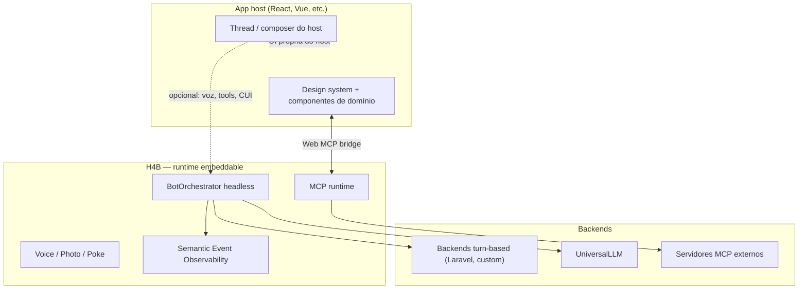

# Hands for Bots — Roadmap de curto prazo

**Horizonte:** 3–6 meses  
**Última atualização:** julho/2026

Este documento define prioridades para tornar o Hands for Bots (H4B) aderente às práticas atuais de interfaces conversacionais com LLM — streaming, MCP, Web MCP, multimodal, A2A e observabilidade — com foco em **adoção embeddable** em apps host (React, design systems próprios, backends turn-based).

**Relacionados:**

- [README](./README.md) — visão geral da biblioteca
- [Core](./docs/en-us/core.md) — arquitetura de plugins e orquestração
- [MCP Tools](./docs/en-us/plugins/mcp-tools.md) — padrão atual de tools inline
- [Observability roadmap (HfB)](./handsforbots/Libs/SemanticEventObservability/docs/handsforbots-roadmap.md) — métricas e traces

---

## Tese estratégica

O H4B nasceu como CUI híbrido: assistente que conversa **e** interage com a GUI. O mercado evoluiu para runtimes composáveis (assistant-ui, Vercel AI SDK, MCP como protocolo de facto, A2A emergente).

**Posicionamento de curto prazo:** o H4B não precisa ser o shell completo do chat. Precisa ser um **runtime headless de capacidades** — orquestração, MCP, voz, multimodal, CUI na GUI, telemetria — que o app host consome por peças, mantendo sua própria UI e design system.



---

## Estado atual vs. mercado

| Capacidade de mercado | Estado H4B hoje | Gap |
|----------------------|-----------------|-----|
| **Streaming SSE** (latência percebida) | `stream: false` nos backends | Alto |
| **MCP tools** | `MCPHelper` + plugins locais (ImageGallery, ShowRelevantContent) | Médio — falta cliente MCP remoto |
| **Web MCP** (UI rica no chat via componentes do host) | Conteúdo inline em HTML | Alto |
| **Multimodal** | Plugin Photo (câmera), Voice input/output | Médio — falta pipeline vision + anexos |
| **API turn-based** (sessão + turno síncrono) | RASA, OpenAI, UniversalLLM (request/response) | Alto — falta backend plugin genérico |
| **A2A** (agent-to-agent) | Inexistente | Baixo curto prazo; semear spec |
| **Observabilidade** (traces, tokens, evals) | SemanticEventObservability parcial | Médio — itens P1/P3 pendentes |
| **React composável** | Modo headless pronto; falta adapter React | Médio |
| **Vue composável** | Adapter Vue (`useHandsForBots`, `useBotCommand`) + `examples/vue` | Baixo |
| **Guardrails de ações** | Políticas de ação (`action_policies`) + `loopDetector`; timeouts de backend pendentes | Baixo |

---

## Fases

### Fase 0 — Fundação de adoção (semanas 1–4)

**Objetivo:** permitir embed do H4B em apps React sem duplicar UI nem acoplar ao DOM da lib.

| # | Entrega | Descrição |
|---|---------|-----------|
| 0.1 | **`@handsforbots/headless`** ✅ | `createHeadlessBot()` — store com `subscribe`/`getState`, `send`, `registerCommand`, `destroy` ([docs](./docs/pt-br/headless.md)) |
| 0.1b | **Adapter Vue** ✅ | `createHandsForBots()` + composables ([docs](./docs/pt-br/adapters/vue.md), [`examples/vue`](./examples/vue)) |
| 0.1c | **Políticas de ação** ✅ | Hook antes de comandos e tools MCP, `loopDetector` opcional ([docs](./docs/pt-br/core/action-policies.md)) |
| 0.2 | **Interface `TurnBackend`** | Contrato mínimo documentado: `sendTurn()`, `getSession()`, `supportsStreaming()` — qualquer backend turn-based implementa o port |
| 0.3 | **Plugin `Backend/TurnBased`** | Backend genérico para APIs `bootstrap` → `initialize` → `messages` (turn síncrono); configurável por endpoint e mapeamento de fases |
| 0.4 | **Exemplo `examples/react-bridge`** | Host React monta thread própria; H4B orquestra backend, MCP e eventos; prova o modelo embeddable |

**Critério de sucesso:** um app React com design system próprio usa H4B só para orquestração/backend/MCP, sem “dois apps” visuais.

#### Próximos exemplos — variedade de UI

O exemplo Vue cobre o caso “carrinho”. Os próximos devem mostrar o bot agindo sobre **componentes de UI variados**, sem foco em e-commerce:

| Exemplo | Componente | Comandos ilustrativos |
|---------|------------|-----------------------|
| Mapa | Mapa interativo (Leaflet/MapLibre) | `Map.focus`, `Map.addMarker`, `Map.route` |
| Personagem | Avatar/personagem animado que reage à conversa | `Character.emote`, `Character.lookAt`, `Character.walkTo` |
| Jogo simples | Jogo da velha, quiz ou forca jogado com o bot | `Game.move`, `Game.reveal`, `Game.reset` |
| Ajuda com textos | Editor com sugestões aplicadas pelo bot | `Doc.highlight`, `Doc.suggest`, `Doc.replace` (com confirmação) |
| Gráficos | Painel de dados que o bot filtra e explica | `Chart.filter`, `Chart.highlightSeries`, `Chart.switchType` |

Cada exemplo deve rodar com backend mock (sem Docker) e exercitar pelo menos uma política de ação.

---

### Fase 1 — Streaming (semanas 4–8)

**Objetivo:** aderência ao que assistant-ui, Vercel AI SDK e backends modernos já entregam; reduzir latência percebida.

| # | Entrega | Descrição |
|---|---------|-----------|
| 1.1 | **SSE nos backends** | `UniversalLLM` e `TurnBased` com `stream: true` → `ReadableStream` / eventos na bus |
| 1.2 | **Evento `core.token_delta`** | Emissão incremental durante resposta do backend |
| 1.3 | **Output progressivo** | Plugin `Text` e `spreadOutput` aceitam payload parcial antes de `core.output_ready` |
| 1.4 | **Adapter para libs React** | Callbacks `onChunk` / mapeamento para `ExternalStoreRuntime` (assistant-ui) |
| 1.5 | **Fallback síncrono** | `supportsStreaming: false` preserva o path atual sem breaking change |

**Fluxo de eventos:**

```text
core.calling_backend
  → core.token_delta (N vezes)
  → core.backend_responded
  → core.output_ready (final)
```

**Critério de sucesso:** primeiro token visível em &lt; 500 ms após envio; hosts podem ligar streaming sem trocar de lib de chat.

---

### Fase 2 — MCP de mercado + Web MCP bridge (semanas 6–12)

**Objetivo:** H4B como **cliente MCP real** e ponte para UI nativa do host — não só registry local de plugins com HTML inline.

| # | Entrega | Descrição |
|---|---------|-----------|
| 2.1 | **`MCPClient` remoto** | Transporte SSE/HTTP para servidores MCP externos; `tools/list`, `tools/call`, `resources/read` |
| 2.2 | **Descoberta dinâmica** | Registro de tools em runtime a partir de servidores configurados |
| 2.3 | **`WebMCPBridge` plugin** | Host registra `Map<toolName, renderFn>` (React ou callback); H4B emite `mcp.render_slot` em vez de injetar HTML |
| 2.4 | **Contrato host ↔ bridge** | `postMessage` ou API imperativa: `registerSlot(name, component)`, `unregisterSlot(name)` |
| 2.5 | **Compatibilidade retroativa** | Modo `inline` (HTML) e modo `slot` (host) coexistem por tool |

**Critério de sucesso:** tool que exige UI de domínio renderiza componente do host (mini-card, modal, peek) dentro da thread, com tokens visuais do design system do app.

---

### Fase 3 — Multimodal pragmático (semanas 8–14)

**Objetivo:** cobrir entradas que o mercado já espera, sem investir em VR/gestos no curto prazo.

| # | Entrega | Descrição |
|---|---------|-----------|
| 3.1 | **Anexos no Text input** | Imagem, PDF → payload multimodal no backend |
| 3.2 | **Photo → vision** | Blob/captura encaminhados a providers com suporte vision (via UniversalLLM ou TurnBased) |
| 3.3 | **Voice polish** | Barge-in durante TTS; métricas `hfb_voice_*` (ver observability roadmap) |
| 3.4 | **Poke como context injection** | Documentar e exemplificar: ação na GUI dispara turno com contexto estruturado |

Gestos, VR e wearables permanecem no **horizonte longo** (12–18 meses).

---

### Fase 4 — Observabilidade como produto (paralelo, semanas 4–14)

**Objetivo:** adoção enterprise e loop de qualidade; correlacionar UI, backend e LLM.

Itens prioritários do [handsforbots-roadmap](./handsforbots/Libs/SemanticEventObservability/docs/handsforbots-roadmap.md):

| # | Item | Impacto |
|---|------|---------|
| 4.1 | H3.1 — `traceparent` em `sendToBackend` | Trace ponta a ponta host → backend → LLM |
| 4.2 | H3.2–H3.4 — spans `gen_ai.*` + child spans MCP | Duração, tokens, execução de tools |
| 4.3 | H4.1 — feedback por `turnId` | Avaliação online por turno |
| 4.4 | H4.2 — Langfuse no plugin Observability | Evals e custo em produção |
| 4.5 | Demo E2E em `examples/OBSERVABILITY.md` | Replicável por integradores |

**Critério de sucesso:** um turno completo aparece no Grafana/Langfuse com fases `backend`, `render`, uso de tokens e tools MCP identificáveis.

---

### Fase 5 — A2A — semeadura (horizonte 6+ meses)

O protocolo [Agent-to-Agent (A2A)](https://google.github.io/A2A/) ainda amadurece. Semear agora evita rework se multi-agent entrar no roadmap de produtos consumidores.

| Agora | Depois |
|-------|--------|
| Documentar `AgentDescriptor` no contrato de backend | Agent Card JSON conforme spec |
| Evento `core.agent_delegated` na bus | UI: “consultando agente X” |
| `BotOrchestrator` delegar sub-tarefa a endpoint configurável | Client A2A completo |

Não bloqueia as fases 0–4.

---

## Priorização

```text
P0 — fazer primeiro
├── @handsforbots/headless + exemplo react-bridge
├── Interface TurnBackend + plugin TurnBased
└── traceparent + métricas de turno (observability)

P1 — próximo trimestre
├── Streaming SSE + core.token_delta
├── MCPClient remoto
├── WebMCPBridge (slots React/callback)
└── Anexos + vision (Text / Photo)

P2 — trimestre seguinte
├── Adapter oficial assistant-ui / AI SDK
├── A2A AgentDescriptor (spec + eventos)
└── Voice barge-in + métricas voice completas

P3 — reavaliar com demanda
├── Gestos / captura de movimento
├── VR / ambientes imersivos
└── H4B como shell completo (somente produtos CUI-first)
```

---

## O que não fazer no curto prazo

1. **Substituir a UI do app host** — o valor está no runtime, não em competir com threads React/Shadcn já existentes.
2. **Competir com assistant-ui na thread** — integrar via adapter/runtime, não reimplementar primitivos de lista/composer.
3. **MCP apenas como HTML inline** — o mercado e integrações Web MCP pedem slots renderizados pelo host.
4. **VR/gestos/wearables antes de streaming e MCP remoto** — diferencial de longo prazo, baixo impacto em adoção imediata.

---

## Métrica de sucesso (6 meses)

Ao final do horizonte, o H4B deve ser descrito assim:

> *Runtime headless de conversação híbrida: conecta backends turn-based e LLMs com streaming, servidores MCP externos, e delega render rico ao app host via Web MCP bridge — com traces de ponta a ponta.*

Indicadores mensuráveis:

| Indicador | Meta |
|-----------|------|
| Tempo até primeiro token (streaming) | P95 &lt; 500 ms |
| Integração React sem UI duplicada | Exemplo oficial funcionando |
| Tools MCP remotas | ≥ 1 servidor externo no exemplo |
| Web MCP slots | ≥ 1 tool renderizada pelo host |
| Trace E2E | turno completo no Grafana/Langfuse |

---

## Decisões em aberto

| # | Pergunta | Opções |
|---|----------|--------|
| 1 | Pacote npm `@handsforbots/headless` monorepo ou pacote separado? | Monorepo neste repo vs. publish separado |
| 2 | Transport MCP remoto prioritário? | SSE vs. stdio (browser limita stdio) |
| 3 | Web MCP bridge: `postMessage` vs. callback direto? | Cross-origin/iframes vs. mesmo documento |
| 4 | Streaming default on ou opt-in? | Opt-in preserva compat; default on melhora DX nova |
| 5 | Deprecar Analytics plugin em favor do pipeline Observability? | Unificar (H4.4 do roadmap obs) |

---

## Changelog

| Data | Alteração |
|------|-----------|
| 2026-07-02 | Documento inicial — roadmap 3–6 meses |
| 2026-10-04 | Headless, adapter Vue e políticas de ação entregues; lista de exemplos com UI variada |
