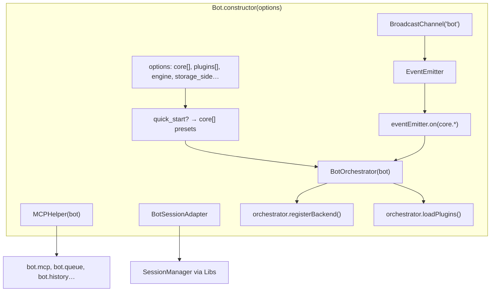
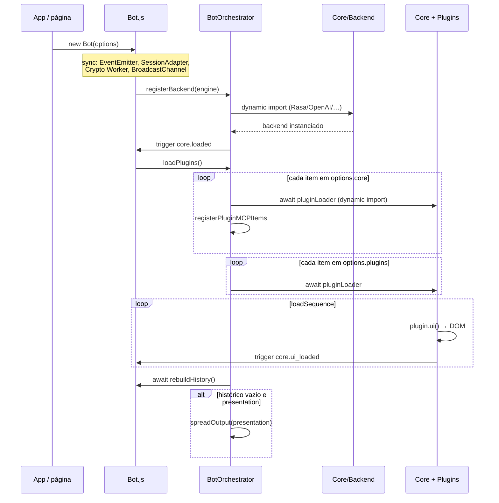
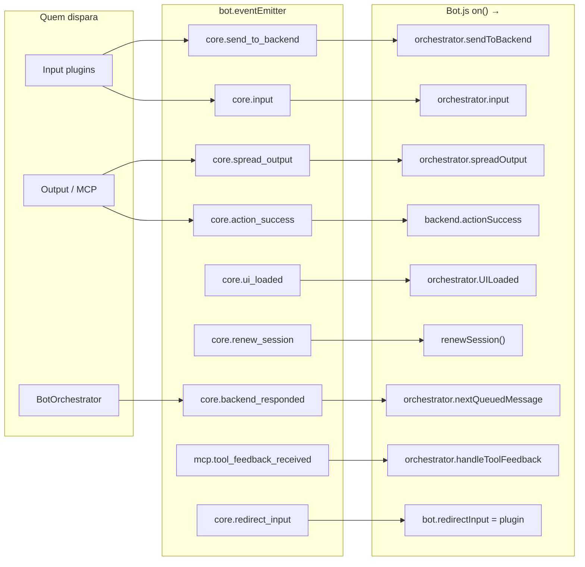
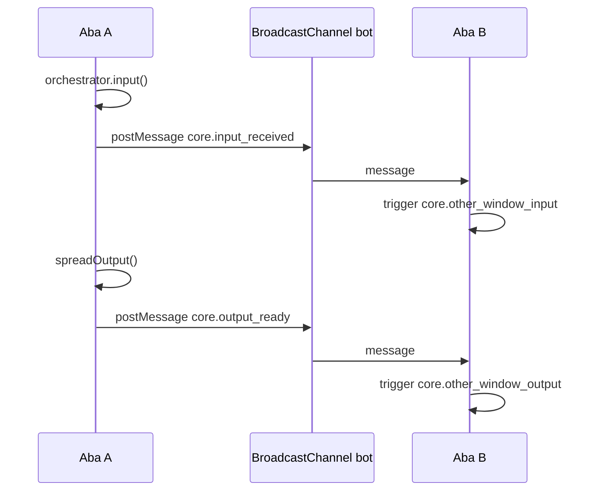
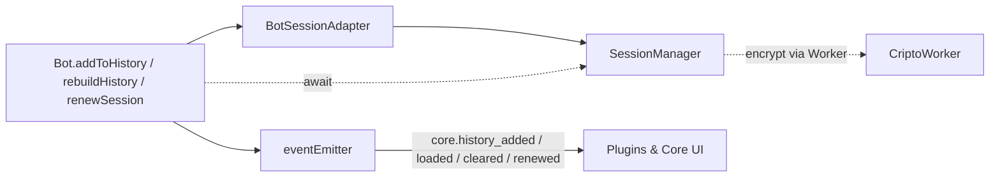
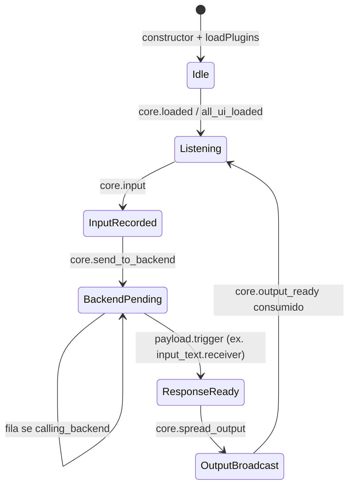

# Fluxo — `Bot.js`

O `Bot.js` é o ponto de entrada da aplicação. Ele monta dependências das **Libs**, instancia o **BotOrchestrator**, registra ouvintes no **EventEmitter** e repassa todo o fluxo operacional ao orchestrator sem implementar a lógica de fila/backend diretamente.

Arquivo: [`handsforbots/Bot.js`](../handsforbots/Bot.js)

## Arquitetura estática

## Bootstrap assíncrono (ordem real)

## Barramento de eventos no `Bot.js`

O Bot **não** processa mensagens diretamente: ele só encadeia eventos ao orchestrator (e em um caso ao backend).

## Estado compartilhado relevante

| Propriedade | Onde é usada | Função no fluxo assíncrono |
|-------------|--------------|----------------------------|
| `calling_backend` | Orchestrator + fila | Evita chamadas paralelas ao motor |
| `queue[]` | Orchestrator | Mensagens enfileiradas enquanto `calling_backend` |
| `redirectInput` | Orchestrator | Desvia `sendToBackend` para um output plugin |
| `history[]` | SessionManager + UI rebuild | Persistência e replay (BotsCommands) |
| `inputs` / `outputs` | Orchestrator, BotsCommands | Registro de plugins por nome |
| `ui_outputs` | spreadOutput | Lista de outputs que recebem `core.output_ready` |
| `bc` (BroadcastChannel) | input/output sync | Réplica entre abas/janelas |

## Sincronização entre abas (`BroadcastChannel`)

## Delegação de sessão e histórico

Métodos públicos do Bot delegam ao `BotSessionAdapter` (Libs). Após persistência, disparam eventos de histórico.

## Papel do Bot no fluxo de uma mensagem (resumo)

O diagrama detalhado de **input → backend → output** está em [02-core.md](./02-core.md). Plugins e Libs estendem os pontos de contato nas abas [03-plugins.md](./03-plugins.md) e [04-libs.md](./04-libs.md).
