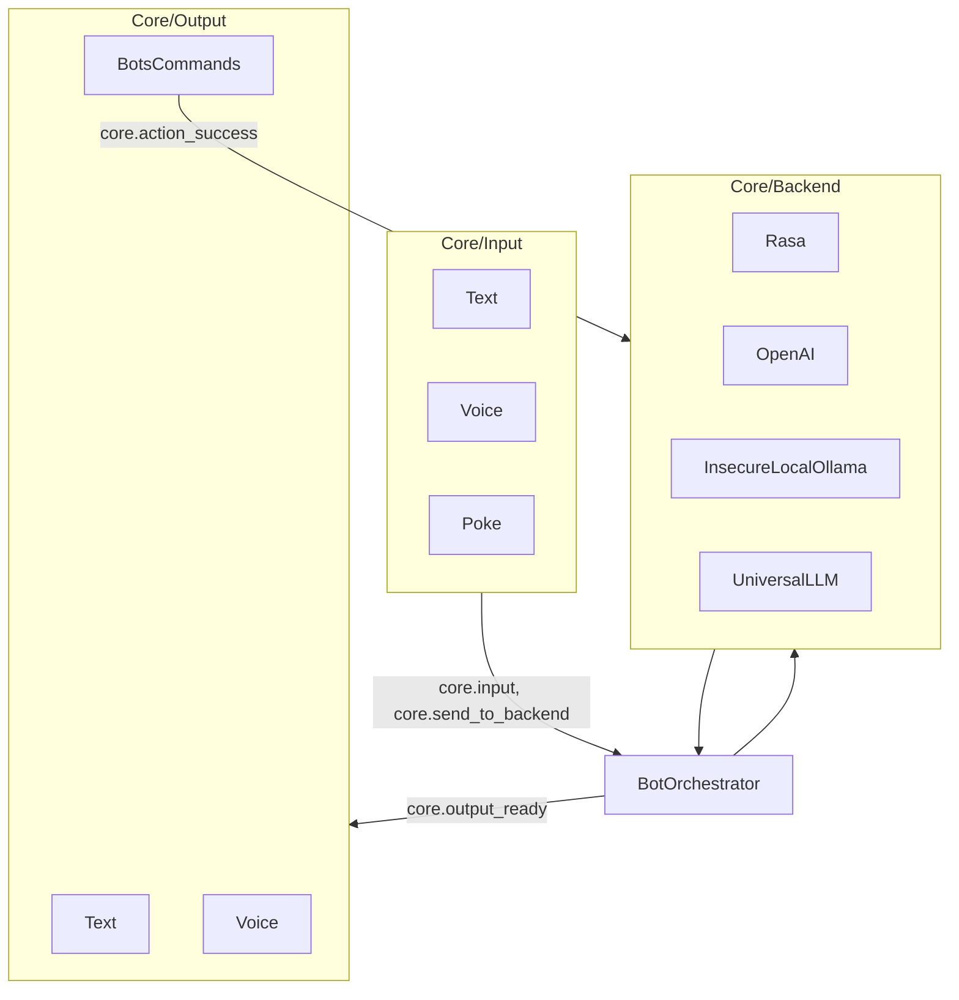
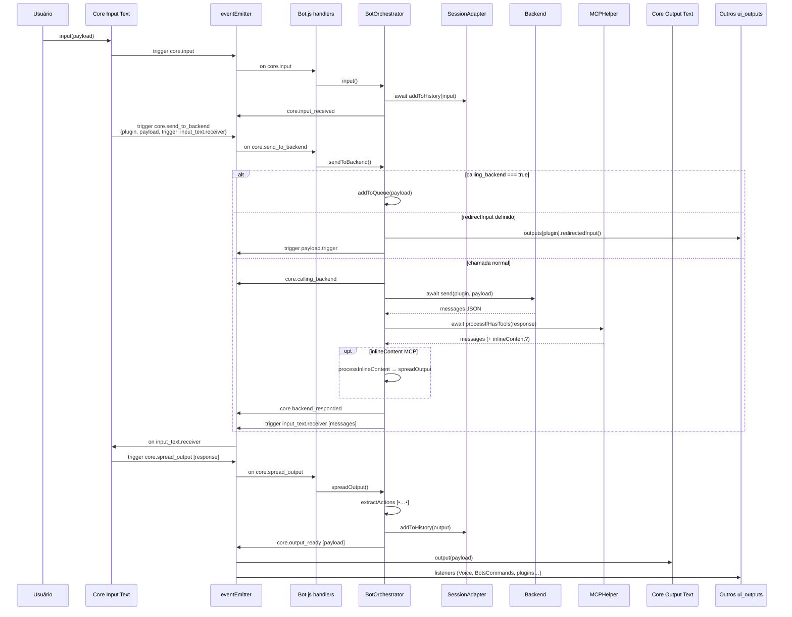
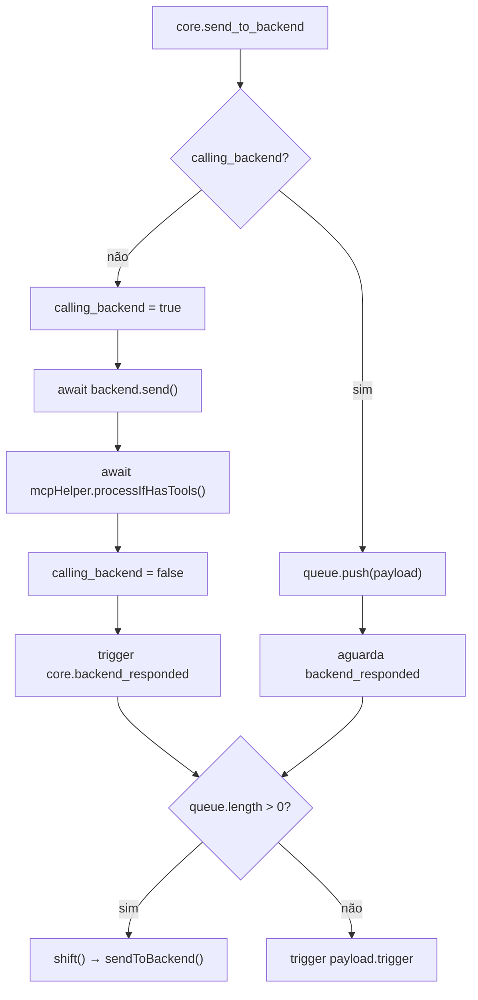
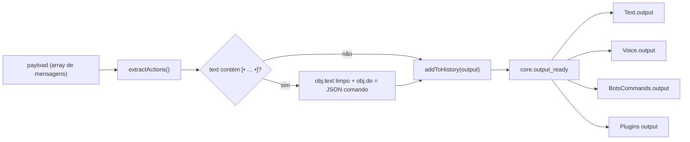
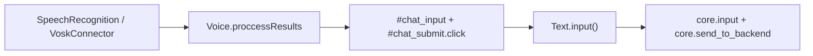
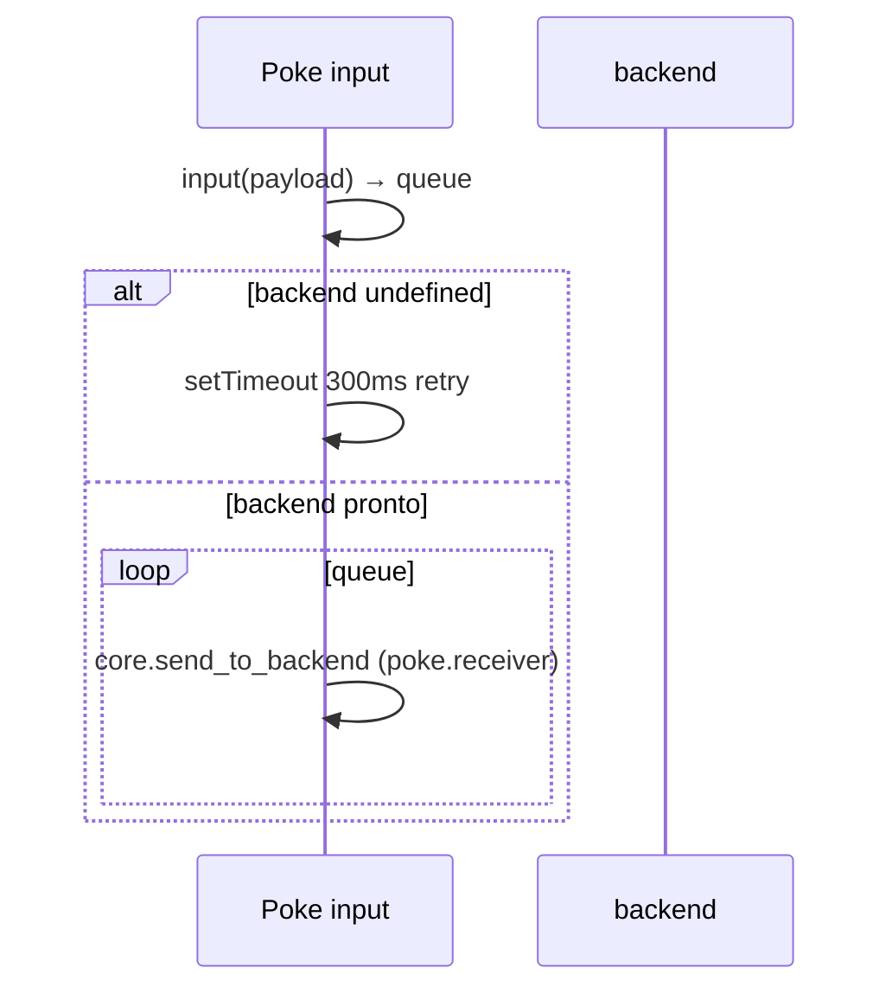
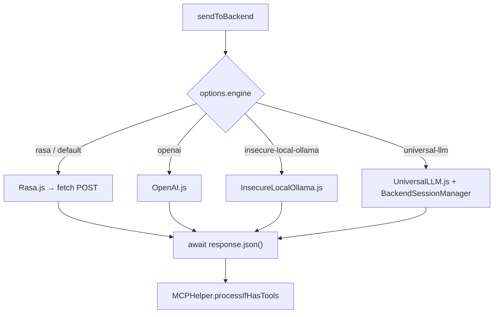
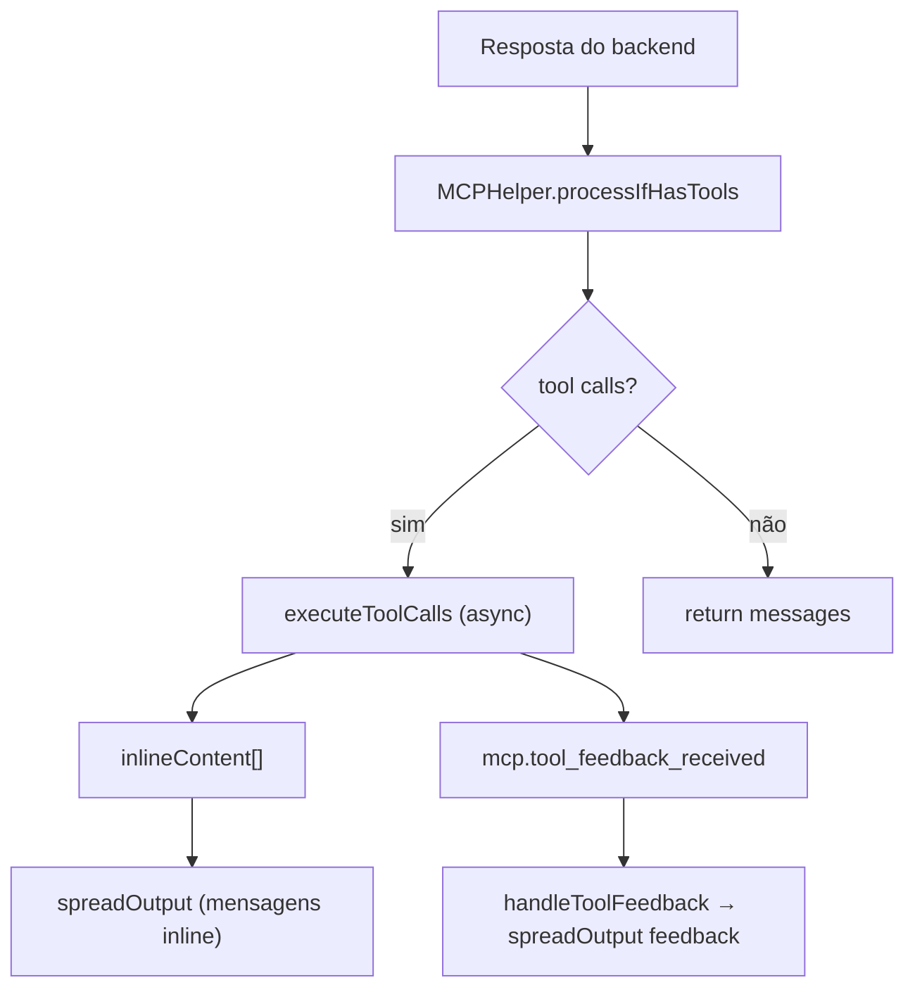
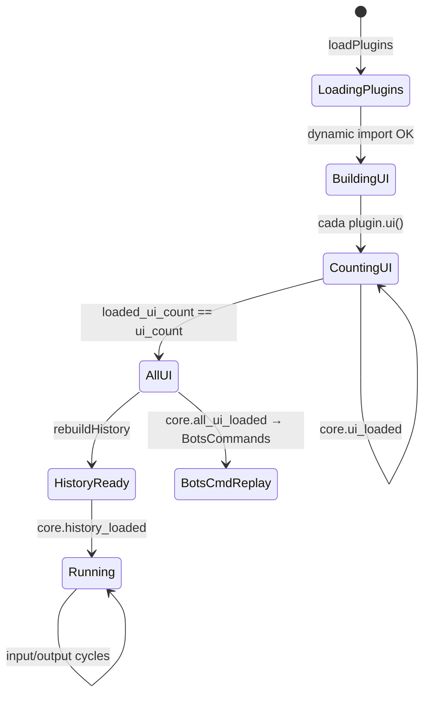

# Fluxo — Core

O **Core** inclui canais de entrada/saída (`Core/Input`, `Core/Output`), motores em `Core/Backend` e o orquestrador [`BotOrchestrator.js`](../handsforbots/Core/BotOrchestrator.js), que concentra fila, histórico, MCP e integração com o backend.

## Mapa de módulos Core



## Fluxo principal: mensagem do usuário até a UI

Exemplo canônico: **Text input** (`Core/Input/Text/Text.js`).



## Fila assíncrona do backend

Garante **uma requisição ativa** por vez; mensagens extras esperam em `bot.queue`.



## `spreadOutput` e action tags



Tags padrão definidas no Bot: `action_tag_open = '[•'`, `action_tag_close = '•]'`.

## BotsCommands — loop de ação assíncrona

[`Core/Output/BotsCommands/BotsCommands.js`](../handsforbots/Core/Output/BotsCommands/BotsCommands.js) escuta `core.output_ready`, executa `obj.do` e devolve resultado ao motor.

```mermaid
sequenceDiagram
  participant Orch as BotOrchestrator
  participant CMD as BotsCommands
  participant Plugin as Output plugin
  participant EE as eventEmitter
  participant BE as Backend

  Orch->>EE: core.output_ready (com obj.do)
  EE->>CMD: output(payload)
  CMD->>CMD: JSON.parse(obj.do)
  CMD->>Plugin: fn(params) Promise
  Plugin-->>CMD: result
  CMD->>EE: core.action_success
  EE->>BE: actionSuccess(response)
  Note over BE: OpenAI/UniversalLLM implementam;<br/>Rasa/Ollama são no-op
```

Após `core.all_ui_loaded`, o BotsCommands reexecuta comandos do histórico (`rebuildHistory` local do plugin).

## Canais de entrada — padrões de contato

| Canal | Dispara | `trigger` customizado | Observação |
|-------|---------|----------------------|------------|
| **Text** | `core.input` + `core.send_to_backend` | `input_text.receiver` | Fluxo completo com histórico |
| **Voice** | Indireto: preenche `#chat_input` e clica submit | (via Text) | `proccessResults` → submit do form Text |
| **Poke** | só `core.send_to_backend` | `poke.receiver` | Fila interna até `backend` existir |
| **Photo** (plugin) | só `core.send_to_backend` | `photo.receiver` | Sem `core.input` |

### Voice — encadeamento com Text



Libs de voz: `SpeechRecognition.js` (nativo) ou `VoskConnector.js` (WebSocket).

### Poke — espera pelo backend



## Backends — contrato `send()`

Todos expõem `async send(plugin, payload)` e retornam array de mensagens estilo Rasa (`recipient_id`, `text`, `image`, `buttons`…).



`UniversalLLM` usa [`BackendSessionManager`](../handsforbots/Libs/BackendSessionManager.js) para sessão no servidor; os demais, em geral, são stateless por requisição (Rasa mantém sessão no servidor via `sender`).

## MCP no orchestrator



Registro de tools na carga do plugin: `registerPluginMCPItems` → `MCPHelper.registerTool/Model/Function`.

## Eventos Core (ciclo de vida UI)



## Redirecionamento de input (`core.redirect_input`)

Quando `bot.redirectInput` está definido, `sendToBackend` **não** chama o motor: encaminha o payload para `outputs[plugin].redirectedInput()` e dispara o `trigger` do payload original. Usado por fluxos guiados (ex. GUIDed) que consomem entrada localmente.
