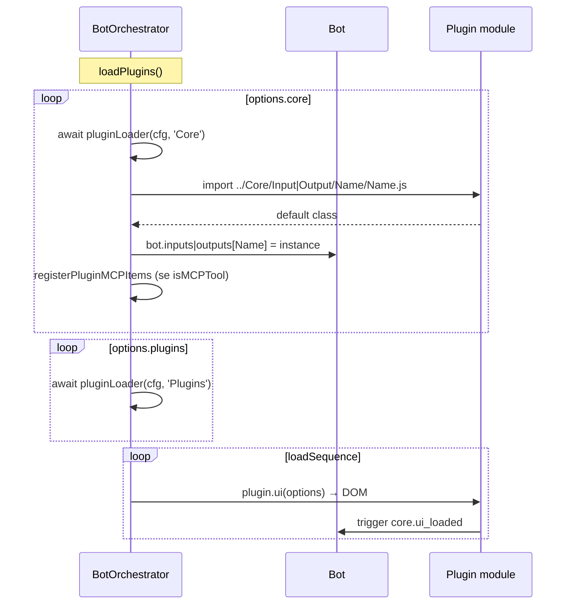
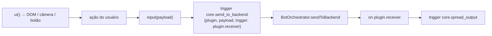
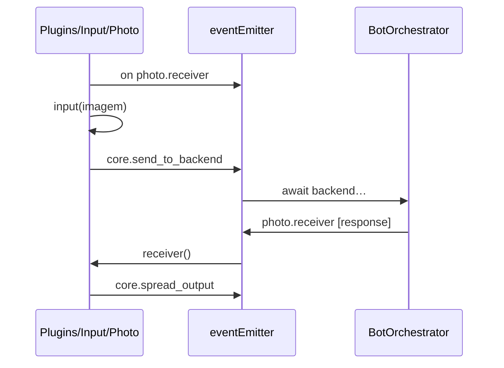
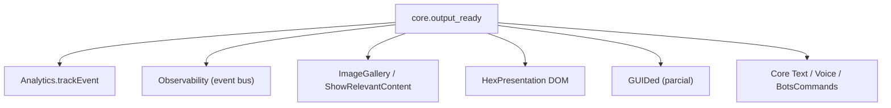
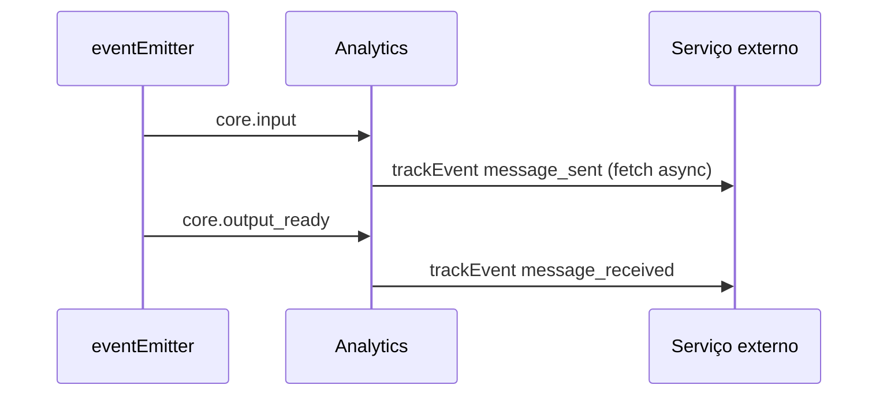
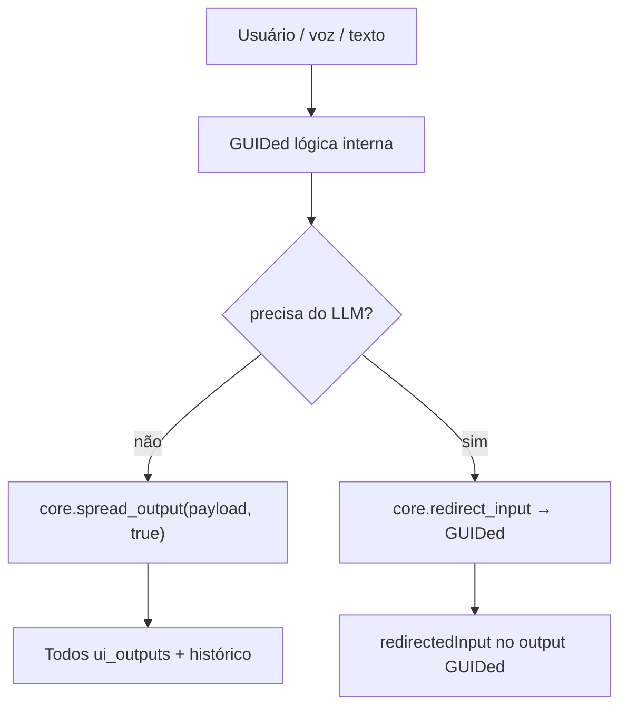
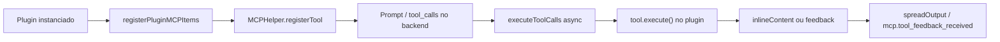
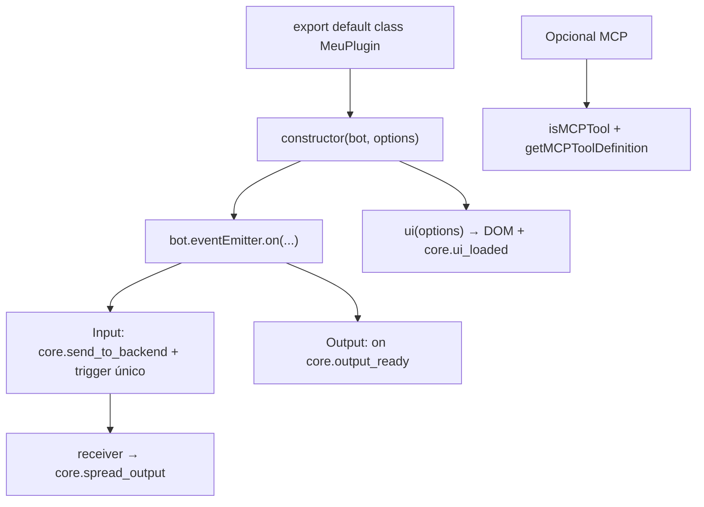

# Fluxo — Plugins

Plugins customizados ficam em [`handsforbots/Plugins/`](../handsforbots/Plugins/). O Core segue a **mesma convenção** de pastas (`Input/<Nome>/<Nome>.js`, `Output/<Nome>/<Nome>.js`), mas é carregado com `source: 'Core'` no `pluginLoader`.

## Carregamento dinâmico



Caminho de import gerado em runtime:

`../{Core|Plugins}/{Input|Output}/{PluginName}/{PluginName}.js`

## Inventário atual

| Plugin | Tipo | Papel no fluxo |
|--------|------|----------------|
| **Photo** | Input | `core.send_to_backend` → `photo.receiver` → `core.spread_output` |
| **Analytics** | Output | Escuta `core.input` e `core.output_ready` (side-effect, não altera chat) |
| **GUIDed** | Output | Tutorial GUI; pode `core.spread_output` com `force`; redirecionamento de input |
| **ImageGallery** | Output + MCP | Tool MCP para galeria |
| **ShowRelevantContent** | Output + MCP | Tool MCP para conteúdo relevante |
| **HexPresentation** | Output | Apresentação em overlay (DOM) |

## Padrão Input plugin



### Exemplo: Photo



Photo **não** dispara `core.input` — o histórico de entrada depende de outros canais ou do backend.

## Padrão Output plugin

Outputs com UI registram-se em `bot.ui_outputs` no `pluginLoader` (type `output`). Reagem a `core.output_ready` ou apenas a eventos próprios.



## Analytics — observador passivo

[`Plugins/Output/Analytics/Analytics.js`](../handsforbots/Plugins/Output/Analytics/Analytics.js) não participa do caminho crítico da resposta; envia eventos HTTP em paralelo.

## Observability — instrumentação do barramento

[`Plugins/Output/Observability/Observability.js`](../handsforbots/Plugins/Output/Observability/Observability.js) é um output passivo que configura [Semantic Event Observability](../handsforbots/Libs/SemanticEventObservability/README.md). Instrumenta `eventEmitter.trigger` / fila / `BroadcastChannel`; exporters opcionais (Faro, OTel, Langfuse, LangSmith). **Não** monitora uptime nem `/health` de backend — ver [escopo](../docs/pt-br/plugins/observability.md#escopo).

```javascript
options.plugins.push({
  type: 'output',
  plugin: 'Observability',
  exporters: ['memory', 'devPanel'],
})
```



## GUIDed — desvio do backend

O GUIDed pode injetar mensagens sem passar pelo motor usando `core.spread_output` com segundo argumento `force` (ignora `redirectInput`).



## Plugins MCP (`isMCPTool`)

Plugins que definem `isMCPTool`, `getMCPToolDefinition()` etc. registram ferramentas no carregamento:



Exemplos: `ImageGallery`, `ShowRelevantContent` (ver também [`Plugins/README_MCP_PLUGIN_PATTERN.md`](../handsforbots/Plugins/README_MCP_PLUGIN_PATTERN.md)).

## Matriz de eventos por plugin

| Plugin | Escuta | Dispara |
|--------|--------|---------|
| Photo | `photo.receiver` | `core.send_to_backend`, `core.spread_output` |
| Analytics | `core.input`, `core.output_ready` | — (HTTP externo) |
| Observability | (wrap `trigger` no bus) | — (exporters opcionais) |
| GUIDed | (interno / voz) | `core.spread_output`, possivelmente `core.redirect_input` |
| ImageGallery / ShowRelevantContent | MCP + UI | via MCPHelper após backend |
| HexPresentation | `core.output_ready` (implícito via UI) | manipulação DOM |

## Extensão: criar um plugin compatível



Configuração na app:

```javascript
options.plugins.push({ plugin: 'MeuPlugin', type: 'input' /* ou output */ })
```

O nome em `plugin` deve ser alfanumérico (`sanitizePluginName`).
