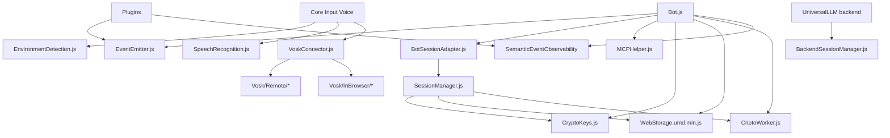
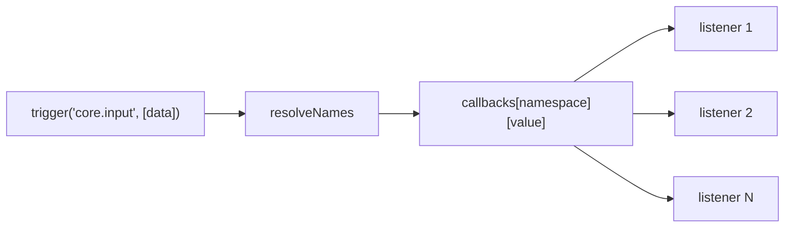
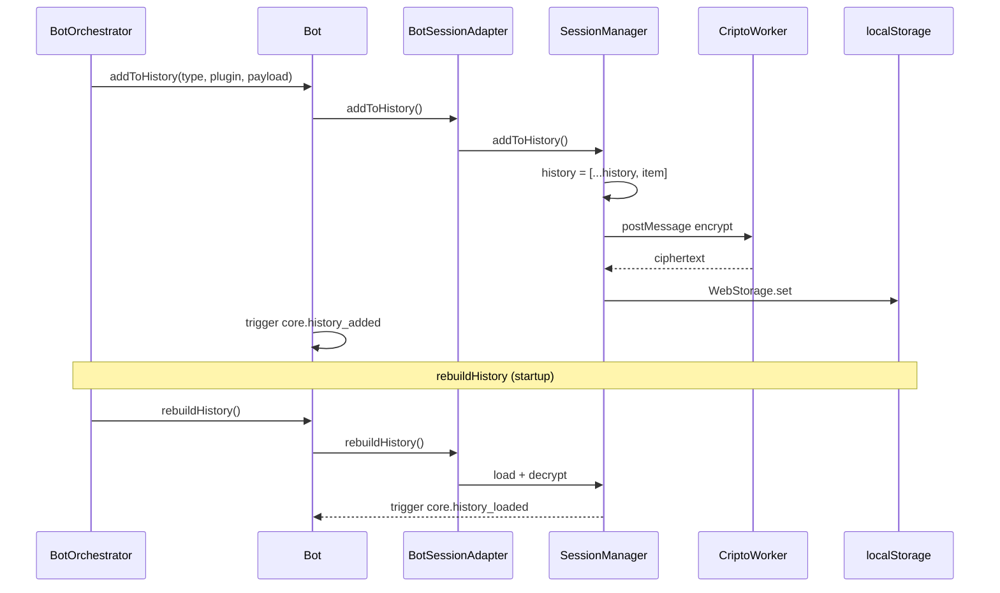
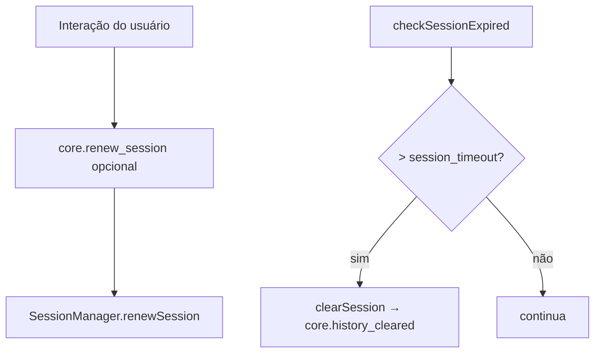
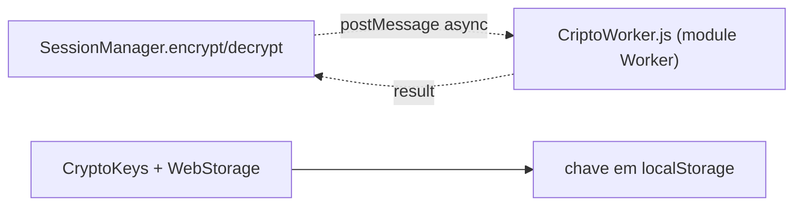
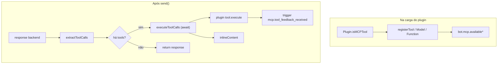
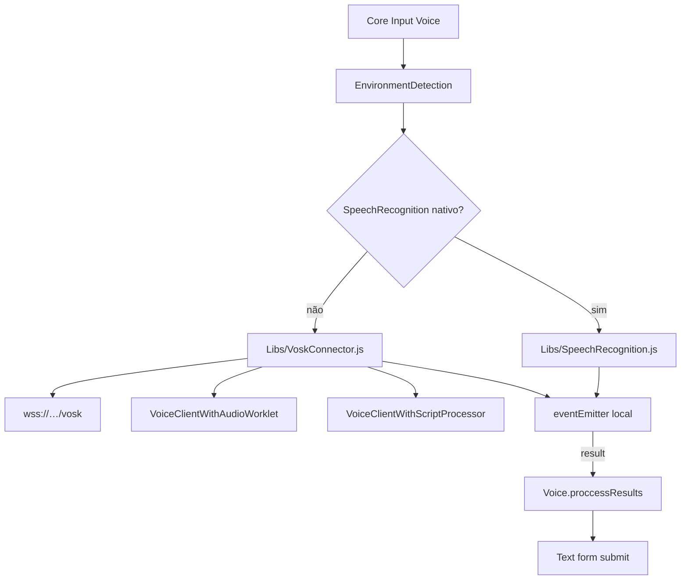
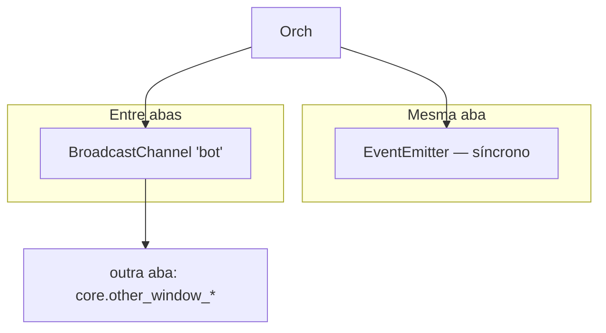
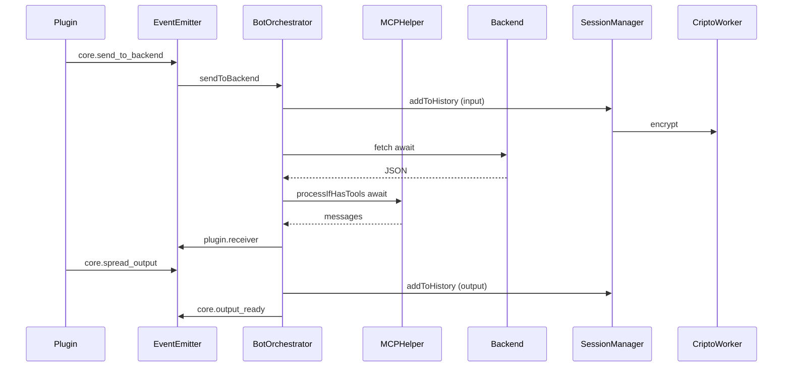

# Fluxo — Libs

Bibliotecas em [`handsforbots/Libs/`](../handsforbots/Libs/) fornecem infraestrutura transversal: eventos, sessão, criptografia, MCP, voz e utilitários. O Bot e o Core **não duplicam** essa lógica — delegam via adapters e imports.

## Mapa de dependências

## Semantic Event Observability

Biblioteca em [`handsforbots/Libs/SemanticEventObservability/`](../handsforbots/Libs/SemanticEventObservability/) — observabilidade semântica para barramentos de eventos assíncronos.

| Componente | Função |
|------------|--------|
| `createObservability()` | Core: policy, correlation, buffer, exporters |
| `adapters/handsforbots.js` | Integração via plugin `Observability` |
| `adapters/genericEventBus.js` | Wrapper genérico `on` / `trigger` |
| `exporters/*` | Faro, OTel, Langfuse, LangSmith (todos opcionais) |
| `grafana/*.json` | Dashboard template para LGTM stack |

Dependências externas são **peer optional** — ausência não quebra o bot. Cobre fluxo conversacional (`sevo_*`: turnos, fases, fila, saúde da telemetria) — **não** uptime, `/health` de backend nem probes de plataforma; ver [escopo](../handsforbots/Libs/SemanticEventObservability/docs/architecture.md#scope). Roadmaps: [lib](../handsforbots/Libs/SemanticEventObservability/docs/roadmap.md) · [métricas sevo_*](../handsforbots/Libs/SemanticEventObservability/docs/metrics-roadmap.md) · [Hands for Bots](../handsforbots/Libs/SemanticEventObservability/docs/handsforbots-roadmap.md).

## EventEmitter — barramento in-process

Implementação leve (namespace + callbacks). **Síncrono**: `trigger` executa todos os listeners antes de retornar.

| API | Uso |
|-----|-----|
| `on(name, fn)` | Registrar (Bot, plugins, orchestrator indireto) |
| `trigger(name, args)` | Disparar — args é array passado ao listener |
| `off(name)` | Remover (ex. Voice durante `ignore()`) |

**Importante:** erros em um listener podem interromper a cadeia; não há fila de eventos separada da fila de backend (`bot.queue`).

## Sessão e histórico — cadeia assíncrona

### SessionManager vs BackendSessionManager

| Componente | Quando | Storage |
|------------|--------|---------|
| **SessionManager** | `storage_side !== 'backend'` | `localStorage` + criptografia |
| **BackendSessionManager** | UniversalLLM / APIs com sessão servidor | Cookies / headers / invalidate via API |

Ver [`Libs/README_SessionManagers.md`](../handsforbots/Libs/README_SessionManagers.md).

### Timeout de sessão

## Criptografia — Web Worker

O Bot instancia o worker uma vez no constructor:

`new Worker('./Libs/CriptoWorker.js', { type: 'module' })`

## MCPHelper — pós-processamento do backend

O orchestrator chama `processIfHasTools` **antes** de disparar o `trigger` do plugin de entrada e **depois** pode chamar `spreadOutput` adicional para conteúdo inline.

## Stack de voz

Eventos auxiliares de voz no bot global: `speaking_start`, `speaking_end`, `speechstart`, `speechend`, `start`, `stop` (coordenação com output Voice).

## Outras Libs (papel no fluxo)

| Arquivo | Contato com Bot/Core | Função assíncrona |
|---------|----------------------|-------------------|
| `TextHelper.js` | Utilitário | Helpers de texto |
| `MCPHelper.js` | Bot + Orchestrator | `await executeToolCalls` |
| `EnvironmentDetection.js` | Voice input | Escolha SR vs Vosk |
| `js.cookie.min.js` | Backends | Cookies de sessão |
| `WebStorage.umd.min.js` | Bot, SessionManager | Persistência key-value |

## BroadcastChannel + EventEmitter

Duas camadas de “broadcast”:

| Mensagem BC | Evento na outra aba |
|-------------|---------------------|
| `core.input_received` | `core.other_window_input` |
| `core.output_ready` | `core.other_window_output` |

## Diagrama integrado Libs ↔ Bot ↔ Core

Este é o caminho completo onde **Libs** entram em persistência (SessionManager + Worker) e em pós-processamento (MCPHelper), enquanto **Core/Plugins** definem UI e contratos de evento.
