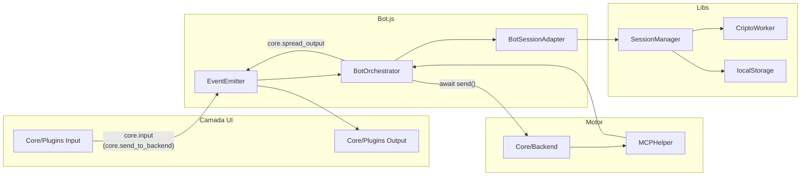

# Fluxo assíncrono — Hands for Bots (dev)

Documentação interna com diagramas do fluxo de informação entre **Bot**, **Core**, **Plugins** e **Libs**. Os diagramas usam [Mermaid](https://mermaid.js.org/); renderizam no GitHub, no VS Code (extensão Markdown Preview Mermaid) e em vários visualizadores de Markdown.

## Índice

| Arquivo | Conteúdo |
|---------|----------|
| [01-bot.md](./01-bot.md) | `Bot.js`: bootstrap, barramento de eventos, delegação ao `BotOrchestrator`, sincronização entre abas |
| [02-core.md](./02-core.md) | Core: inputs, outputs, backend, fila, `spreadOutput`, MCP inline, BotsCommands |
| [03-plugins.md](./03-plugins.md) | Plugins customizados: carregamento, padrões input/output, MCP, Analytics |
| [04-libs.md](./04-libs.md) | Libs: EventEmitter, sessão/criptografia, MCPHelper, voz (Vosk/Speech), BroadcastChannel |

## Visão geral (uma página)

## Convenções usadas nos diagramas

- **Linha sólida (`-->`)**: chamada síncrona ou disparo imediato de evento (`trigger`).
- **Linha tracejada (`-.->`)**: operação `async` / `await` ou efeito assíncrono (fetch, Worker, `setTimeout`).
- **Caixa retangular**: módulo ou classe.
- **Losango**: decisão (fila, redirecionamento, sessão expirada).
- Eventos no formato `core.*` são o contrato principal entre camadas; plugins também usam eventos próprios (`input_text.receiver`, `photo.receiver`, etc.).

## Referência rápida de eventos

| Evento (disparado por) | Ouvido por | Papel |
|------------------------|------------|--------|
| `core.input` | `Bot.js` → `orchestrator.input` | Registra entrada no histórico |
| `core.send_to_backend` | `Bot.js` → `orchestrator.sendToBackend` | Envia ao motor (com fila) |
| `core.backend_responded` | `Bot.js` → `nextQueuedMessage` | Libera próximo item da fila |
| `core.spread_output` | `Bot.js` → `orchestrator.spreadOutput` | Distribui resposta aos outputs |
| `core.output_ready` | Plugins/Core Output | Renderiza UI / analytics / comandos |
| `core.ui_loaded` | `Bot.js` → `UILoaded` | Contagem até `core.all_ui_loaded` |
| `core.action_success` | `Bot.js` → `backend.actionSuccess` | Retorno de ação `[•…•]` |

Documentação de eventos para usuários finais: [docs/pt-br/events.md](../docs/pt-br/events.md).
