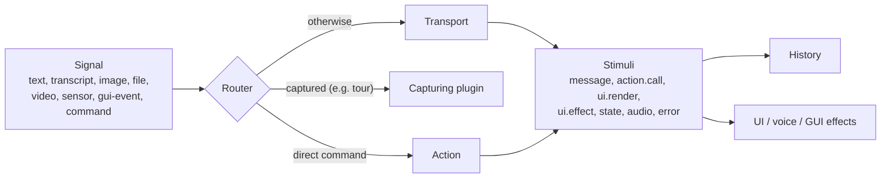

# Concepts

## Signals → turns → stimuli

Everything that enters H4B is a **signal**; everything that comes back is a **stream of stimuli**.



- A **trigger** signal starts a turn. A **context** signal (`kind: 'context'`) is kept and sent with every turn until replaced (same `key`) or removed: current page, selection, sensor readings, camera frames.
- **Parts** carry content: `text`, media (`image`, `audio`, `video`, `file` as Blob, base64 or URL) and `data` (structured values).
- **Stimuli** are what backends (and direct commands) produce: `message.start/delta/part/end`, `action.call`, `action.result`, `ui.render`, `ui.effect`, `state.snapshot/patch`, `audio`, `custom`, `error`. A synchronous backend is just a stream with one batch.

## Routes

Every trigger is resolved by one route, recorded on its messages and turn status:

| Route | When |
|-------|------|
| `direct` | A matcher (e.g. the menu) recognized a command: the action runs without any backend. Recorded as a synthetic tool call + result, so the LLM sees it next turn. |
| `capture` | A plugin is capturing input (e.g. "next" during a guided tour). Only signals it accepts are captured. |
| `transport` | The configured backend handles it. |
| `agent` | An external agent (WebMCP) ran an action. |
| `push` | The backend sent stimuli outside a turn (WebSocket, long jobs). |

Turns run one at a time, in order. Each has a status: `received → acting → done | error | aborted`. UIs should render both fast (direct) and slow (LLM) routes with the same states, holding each briefly so instant commands don't flicker. The widget does this for you.

## Actions

An action is a capability of your GUI: name, description, input schema (Standard Schema or JSON Schema), handler.

- **One action, three triggers:** the assistant (tool call), the user (menu, buttons, `runAction`) and browser agents (WebMCP).
- **Origins and trust:** `user` > `assistant` > `agent`. `exposeTo` limits who can call it; `destructive: true` asks for confirmation (through the `confirm` service) for every origin.
- **Validation** happens before the handler; invalid calls return an error to the caller, they never throw into your UI.
- `call.render(component, props)` lets a handler show rich content in the reply (e.g. a gallery).

## Synchronous and asynchronous

| Mechanism | Purpose | Does the flow wait? |
|-----------|---------|---------------------|
| Notification (`on` / `emit`) | Observe: UI, telemetry, sync | No. Slow or failing listeners never affect the turn |
| Interceptor (`intercept`) | Transform or veto: redact PII, block an action, drop a stimulus | Yes, in priority order. Return `null` to drop/cancel |
| Service contract | Do the work: transport, actions, matchers, storage, confirmation | Yes |
| Awaitable host API | Use H4B like a function | Yes |

All accept sync or async functions. Interception points: `signal.before`, `request.before`, `action.before`, `stimulus.before`.

```ts
const { status, messages } = await h4b.ask('show late orders')   // awaits the turn
await h4b.runAction('open_order', { id: '1042' })                // through the queue, recorded
await h4b.push([{ type: 'message.delta', messageId: 'x', delta: 'Your report is ready.' }]) // outside a turn
await h4b.when('turn.status', (s) => s.phase === 'done')         // wait for an event
h4b.abort()                                                      // cancel the running turn (barge-in)
```

## Plugins and services

The kernel is small; everything else is a plugin: `{ name, inject, provides, config, apply(ctx, config) }`. Plugins **provide services** under stable keys (`transport`, `storage`, `voice`, `menu`, `camera`…) and may **inject** others (they mount after their dependencies). Everything a plugin registers through `ctx` (listeners, services, actions, matchers, interceptors, effects) is undone when it is disposed, so plugins can be mounted and removed at runtime (`h4b.use(plugin)`). See [Writing plugins](./writing-plugins.md).

## State and history

- `h4b.messages`: user, assistant and tool messages (immutable; safe for React's `useSyncExternalStore`).
- `h4b.state`: shared state the backend can set with `state.snapshot` / `state.patch` (JSON Patch).
- Persistence and tab sync are plugins: `storage-local`, `storage-backend`, `tab-sync`.
- To record interface decisions in the history and build a timeline, see [History](./history.md).
