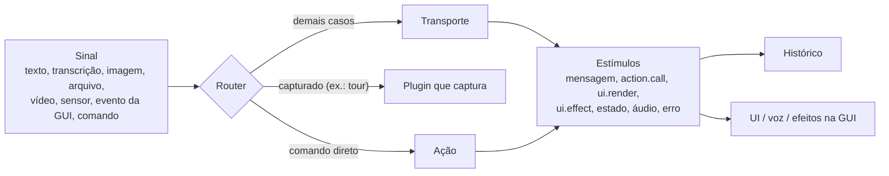

# Conceitos

## Sinais → turnos → estímulos

Tudo o que entra no H4B é um **sinal**; tudo o que volta é um **stream de estímulos**.



- Um sinal **trigger** inicia um turno. Um sinal de **contexto** (`kind: 'context'`) fica guardado e vai junto em todo turno até ser substituído (mesma `key`) ou removido: página atual, seleção, leituras de sensores, quadros da câmera.
- **Parts** carregam o conteúdo: `text`, mídia (`image`, `audio`, `video`, `file` como Blob, base64 ou URL) e `data` (valores estruturados).
- **Estímulos** são o que os backends (e os comandos diretos) produzem: `message.start/delta/part/end`, `action.call`, `action.result`, `ui.render`, `ui.effect`, `state.snapshot/patch`, `audio`, `custom`, `error`. Um backend síncrono é só um stream com um lote.

## Rotas

Cada trigger é resolvido por uma rota, registrada nas mensagens e no status do turno:

| Rota | Quando |
|------|--------|
| `direct` | Um matcher (ex.: o menu) reconheceu um comando: a ação roda sem backend. Fica registrada como tool call sintética + resultado, então o LLM a vê no turno seguinte. |
| `capture` | Um plugin está capturando a entrada (ex.: "próximo" durante um tour). Só os sinais que ele aceita são capturados. |
| `transport` | O backend configurado trata. |
| `agent` | Um agente externo (WebMCP) executou uma ação. |
| `push` | O backend mandou estímulos fora de um turno (WebSocket, jobs longos). |

Os turnos rodam um por vez, em ordem. Cada um tem status: `received → acting → done | error | aborted`. As UIs devem mostrar a rota rápida (direta) e a lenta (LLM) com os mesmos estados, segurando cada um brevemente para comandos instantâneos não piscarem. O widget já faz isso.

## Ações

Uma ação é uma capacidade da sua interface: nome, descrição, schema de entrada (Standard Schema ou JSON Schema) e handler.

- **Uma ação, três gatilhos:** o assistente (tool call), o usuário (menu, botões, `runAction`) e agentes do navegador (WebMCP).
- **Origens e confiança:** `user` > `assistant` > `agent`. `exposeTo` limita quem pode chamar; `destructive: true` pede confirmação (pelo serviço `confirm`) para qualquer origem.
- **Validação** acontece antes do handler; chamadas inválidas devolvem erro a quem chamou, nunca estouram na sua UI.
- `call.render(componente, props)` permite que um handler mostre conteúdo rico na resposta (ex.: uma galeria).

## Síncrono e assíncrono

| Mecanismo | Para quê | O fluxo espera? |
|-----------|----------|-----------------|
| Notificação (`on` / `emit`) | Observar: UI, telemetria, sincronização | Não. Listeners lentos ou com erro nunca afetam o turno |
| Interceptador (`intercept`) | Transformar ou vetar: ocultar dados pessoais, bloquear ação, descartar estímulo | Sim, por prioridade. Retornar `null` descarta/cancela |
| Contrato de serviço | Fazer o trabalho: transporte, ações, matchers, storage, confirmação | Sim |
| API aguardável do host | Usar o H4B como uma função | Sim |

Todos aceitam funções síncronas ou assíncronas. Pontos de interceptação: `signal.before`, `request.before`, `action.before`, `stimulus.before`.

```ts
const { status, messages } = await h4b.ask('mostrar pedidos atrasados') // aguarda o turno
await h4b.runAction('open_order', { id: '1042' })                        // pela fila, registrado
await h4b.push([{ type: 'message.delta', messageId: 'x', delta: 'Seu relatório ficou pronto.' }]) // fora de turno
await h4b.when('turn.status', (s) => s.phase === 'done')                 // espera um evento
h4b.abort()                                                              // cancela o turno atual (barge-in)
```

## Plugins e serviços

O kernel é pequeno; o resto é plugin: `{ name, inject, provides, config, apply(ctx, config) }`. Plugins **fornecem serviços** com chaves estáveis (`transport`, `storage`, `voice`, `menu`, `camera`…) e podem **injetar** outros (montam depois das dependências). Tudo o que um plugin registra pelo `ctx` (listeners, serviços, ações, matchers, interceptadores, efeitos) é desfeito quando ele é descartado, então plugins podem entrar e sair em runtime (`h4b.use(plugin)`). Veja [Escrevendo plugins](./writing-plugins.md).

## Estado e histórico

- `h4b.messages`: mensagens do usuário, do assistente e de ferramentas (imutáveis; seguras para `useSyncExternalStore` do React).
- `h4b.state`: estado compartilhado que o backend define com `state.snapshot` / `state.patch` (JSON Patch).
- Persistência e sincronização entre abas são plugins: `storage-local`, `storage-backend`, `tab-sync`; quanto é enviado e guardado é o plugin `memory`, montado por padrão.
- Para registrar decisões da interface no histórico e montar uma linha do tempo, veja [Histórico](./history.md).
