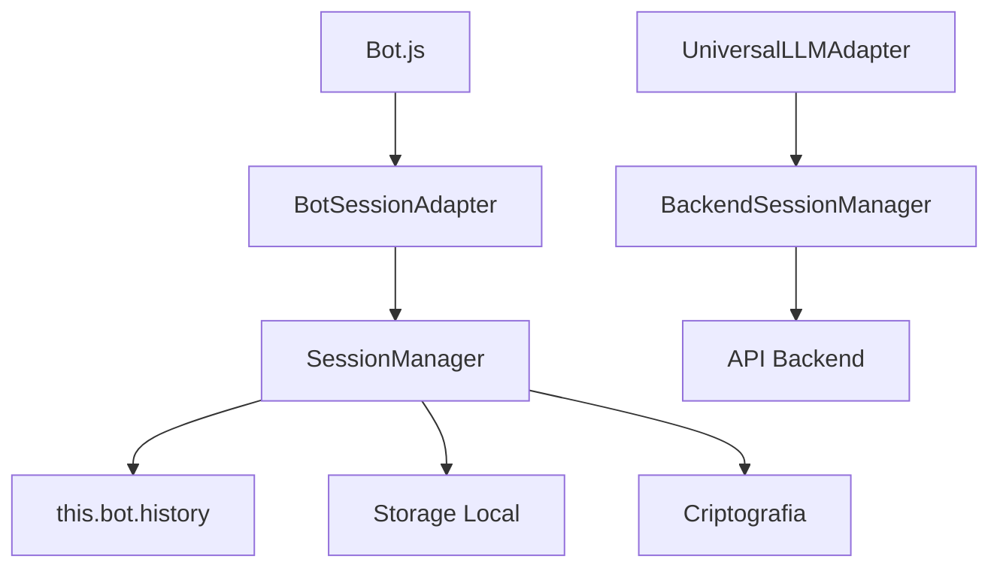

# Session Managers - Sistema de Sessões do Bot

Sistema modular para gerenciamento de sessões, histórico e storage do bot.

## Arquivos Principais

### 1. **SessionManager** - Sessões Locais
- **Usado por**: Bot.js via BotSessionAdapter
- **Arquivo**: `Libs/SessionManager.js`
- **Histórico**: Sempre mantido em `this.bot.history` para compatibilidade total

### 2. **BackendSessionManager** - Sessões de API
- **Usado por**: UniversalLLMAdapter
- **Arquivo**: `Libs/BackendSessionManager.js`
- **Sessões**: Gerenciadas via API backend

### 3. **BotSessionAdapter** - Ponte de Compatibilidade
- **Usado por**: Bot.js
- **Arquivo**: `Libs/BotSessionAdapter.js`
- **Função**: Mantém compatibilidade total com API original do Bot.js

## Principais Correções Implementadas

### ✅ **Problema 1: Primeira mensagem se perdia**
**Causa**: SessionManager.encrypt() chamava clearSession() em caso de erro, limpando o histórico.
**Solução**: Remover clearSession() dos métodos encrypt/decrypt - apenas gerar nova chave.

### ✅ **Problema 2: Histórico não sincronizava**
**Causa**: SessionManager usava this.history.push() que não disparava o setter.
**Solução**: Usar spread operator: `this.history = [...this.history, newItem]`

### ✅ **Problema 3: RebuildHistory sobrescrevia histórico atual**
**Causa**: rebuildHistory() sempre sobrescrevia, mesmo com mensagens recentes.
**Solução**: Só sobrescrever se histórico atual estiver vazio.

## Integração no Bot.js

```javascript
import BotSessionAdapter from './Libs/BotSessionAdapter.js'

// No constructor do Bot.js:
this.history = []  // Inicializar ANTES do SessionAdapter

this.sessionAdapter = new BotSessionAdapter(this, {
    session_timeout: this.session_timeout,
    crypto_worker: this.crypto_worker,
    storage_side: this.options.storage_side
})

// ✅ HISTÓRICO SEMPRE EM this.bot.history
// O SessionManager usa getters/setters para acessar this.bot.history
// Garante compatibilidade total com código existente
```

## API Compatível

### Bot.js - Métodos Mantidos
```javascript
// ANTES (Bot.js original):
async addToHistory(type, plugin, payload, title = null) {
    // ... validações ...
    const history = [type, plugin, payload, title]
    this.history.push(history)
    
    const d = new Date()
    this.renewSession(d.getTime())
    
    const history_json = JSON.stringify(this.history)
    const encrypted_history = await this.cryptography(history_json, 'encrypt')
    
    this.storage.setItem('history', encrypted_history, error => {
        if (error) console.error(error)
    })
}

// DEPOIS (com SessionManager):
async addToHistory(type, plugin, payload, title = null) {
    return await this.sessionAdapter.addToHistory(type, plugin, payload, title)
}
```

### Propriedades Mantidas
```javascript
// Todas essas propriedades continuam funcionando:
bot.history              // Array de histórico
bot.history_loaded       // Boolean de status
bot.sessionAdapter       // Adapter principal
bot.session_timeout      // Timeout em minutos
bot.lastInteraction      // Timestamp da última interação

// Métodos mantidos:
bot.addToHistory()       // Adicionar ao histórico
bot.rebuildHistory()     // Reconstruir do storage
bot.renewSession()       // Renovar sessão
bot.checkSessionExpired()// Verificar expiração
bot.clearStorage()       // Limpar storage
bot.cryptography()       // Criptografar/descriptografar
```

## Fluxo de Dados



## Validação e Testes

### 1. Teste de Compatibilidade
```javascript
// Verificar se todas as propriedades ainda funcionam:
console.assert(bot.history.length >= 0)
console.assert(typeof bot.lastInteraction === 'number')
console.assert(typeof bot.session_timeout === 'number')

// Verificar se métodos ainda funcionam:
await bot.addToHistory('input', 'Test', 'test message')
bot.renewSession()
bot.checkSessionExpired()
```

### 2. Teste de Funcionalidades
```javascript
// Testar histórico
const initialLength = bot.history.length
await bot.addToHistory('input', 'Test', 'message')
console.assert(bot.history.length === initialLength + 1)

// Testar sessão backend
const sessionManager = new BackendSessionManager({
    apiUrl: 'https://api.exemplo.com',
    apiKey: 'sua-chave'
})
const sessionId = await sessionManager.getSessionId()
console.assert(typeof sessionId === 'string')
```

### 3. Teste do Bug Corrigido
```javascript
// Teste: Primeira mensagem não deve se perder
const initialLength = bot.history.length
await bot.addToHistory('input', 'Text', 'primeira mensagem', 'Primeira mensagem')
console.assert(bot.history.length === initialLength + 1, 'Primeira mensagem foi perdida!')

// Simular resposta do bot
await bot.addToHistory('output', ['Text'], JSON.stringify([{text: 'Resposta do bot'}]))
console.assert(bot.history.length === initialLength + 2, 'Histórico não mantido após resposta!')
```

## Diretrizes de Desenvolvimento

### 1. **Não Alterar APIs Públicas**
- Manter todas as propriedades públicas (bot.history, bot.sessionId, etc.)
- Manter todos os métodos públicos com mesma assinatura
- Manter todos os eventos existentes

### 2. **Princípios de Arquitetura**
- **SessionManager**: Apenas storage local e criptografia
- **BackendSessionManager**: Apenas comunicação com API
- **BotSessionAdapter**: Apenas bridge de compatibilidade
- **Bot.js**: Interface principal, delega para adapters

### 3. **Tratamento de Erros**
- Nunca limpar histórico em caso de erro de criptografia
- Logs detalhados para debugging
- Fallbacks para funcionalidade sem criptografia
- Manter funcionamento mesmo se storage falhar

### 4. **Performance**
- Cache de propriedades quando apropriado
- Lazy loading de recursos pesados
- Debounce em operações frequentes (checkSessionExpired)
- Batch operations para storage

## Troubleshooting

### Histórico se perde na primeira mensagem
✅ **Resolvido**: Era causado por clearSession() no encrypt(). Removido.

### Storage não funciona
- Verificar se WebStorage está disponível
- Verificar se localStorage está habilitado no browser
- Verificar se CryptoWorker está carregado

### Sessões backend falham
- Verificar conectividade de rede
- Verificar URL e chave da API
- Verificar formato de resposta da API

### Performance lenta
- Verificar tamanho do histórico (> 1000 itens)
- Verificar frequência de checkSessionExpired()
- Verificar se criptografia está sendo usada desnecessariamente

## Logs de Debug

Para debugar problemas, ative os logs:

```javascript
// No console do browser:
localStorage.setItem('bot-debug', 'true')

// Logs relevantes:
// [✔︎] SessionManager initialized
// [✔︎] BotSessionAdapter initialized  
// [✔︎] BackendSessionManager initialized
// [✔︎] SessionManager: Histórico de conversa recuperado
// [ℹ] SessionManager: Nenhum histórico anterior encontrado
```
