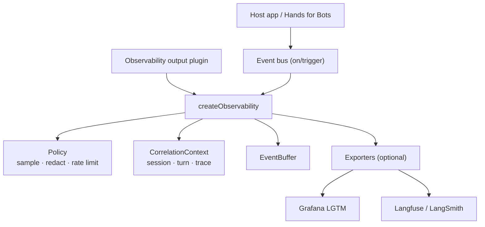

# Architecture



## Semantic event schema

Each recorded event includes:

| Field | Description |
|-------|-------------|
| `id` | Unique event id |
| `timestamp` | ISO-8601 |
| `type` | `bus.trigger`, `bus.listener`, `turn.start`, `turn.end`, `custom` |
| `name` | Event name (`core.input`, …) |
| `sessionId` | Browser session |
| `turnId` | Conversation turn (correlates input → output) |
| `traceId` | Trace id for OTel/Faro/Langfuse |
| `payloadSummary` | Redacted preview |
| `state` | Optional host state (queue depth, …) |
| `durationMs` | Turn duration on `turn.end` |

## Turn correlation

Configure which bus events open/close a turn:

```javascript
turnStartEvents: ['core.input'],
turnEndEvents: ['core.output_ready'],
```

Turn boundaries drive spans in OTel, runs in LangSmith, and turn panels in Grafana.

## Fail-safe design

- Exporter `init()` errors are caught per exporter.
- Optional modules use dynamic `import()` inside try/catch.
- Missing peer dependencies → exporter marked unavailable.
- Telemetry never throws into application event handlers.

## Extraction to standalone npm package

```
SemanticEventObservability/
├── packageIdentity.js   ← rename here
├── package.json
├── index.js
├── core/
├── adapters/
├── exporters/
├── utils/
├── grafana/
└── docs/
```

The Hands for Bots repo keeps a thin adapter import until the package is published.
