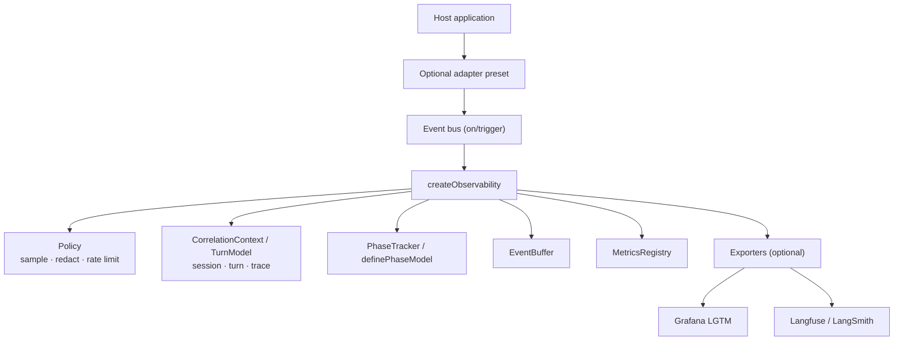

# Architecture

Host-agnostic design. For **Hands for Bots** integration, see [handsforbots-adapter.md](./handsforbots-adapter.md). For planned abstractions, see [roadmap.md](./roadmap.md).



## Scope

This library answers **how the conversational flow behaves while the app is running** — not **whether the service is reachable**.

| In scope (`sevo_*`) | Out of scope (other stack) |
|---------------------|----------------------------|
| Turn and phase latency | Uptime / synthetic monitoring |
| Turn completion, abandonment, errors | Backend `/health` endpoints (e.g. Rasa `/api/health`) |
| Queue pressure via `stateProvider` | Kubernetes liveness/readiness probes |
| Telemetry pipeline health (`sevo_exporter_errors_total`, policy drops) | Server-side APM for backends (`gen_ai.*`) |
| Optional Core Web Vitals (`sevo_web_vital`) | Binary “application is up” alerts |

**Functional degradation** can be inferred from metrics (abandoned turns, persistent queue depth, exporter failures). **Absence of metrics** does not prove an outage — export may be disabled, sampled, or the collector may be down.

Full boundaries: [roadmap.md](./roadmap.md#boundary-library-vs-host).

## Semantic event schema

Each recorded event includes:

| Field | Description |
|-------|-------------|
| `id` | Unique event id |
| `timestamp` | ISO-8601 |
| `type` | `bus.trigger`, `bus.listener`, `turn.start`, `turn.end`, `turn.abandoned`, `phase.start`, `phase.end`, `custom` |
| `name` | Event name (`core.input`, …) |
| `sessionId` | Browser session |
| `turnId` | Conversation turn (correlates input → output) |
| `traceId` | Trace id for OTel/Faro/Langfuse |
| `payloadSummary` | Redacted preview |
| `state` | Optional host state (queue depth, …) |
| `durationMs` | Turn duration on `turn.end` |

## Turn correlation

Configure which bus events open/close a turn via `turnStartEvents` / `turnEndEvents` (formal **TurnModel** in [roadmap.md](./roadmap.md)):

```javascript
turnStartEvents: ['user.message'],
turnEndEvents: ['bot.response'],
phases: definePhaseModel([
  { id: 'backend', startEvent: 'api.call', endEvent: 'api.done' },
]),
```

Hands for Bots preset: `core.input` / `core.output_ready` — see [handsforbots-adapter.md](./handsforbots-adapter.md).

Turn boundaries drive spans in OTel, runs in LangSmith, and turn panels in Grafana.

Each turn produces a **single Tempo trace** (root `turn:*`, children `phase:*` + `event:*`). Phase children are configured via **PhaseModel** (planned; today backend phase is hardcoded in the OTel exporter).

## Fail-safe design

- Exporter `init()` errors are caught per exporter.
- Optional modules use dynamic `import()` inside try/catch.
- Missing peer dependencies → exporter marked unavailable.
- Telemetry never throws into application event handlers.

## Extraction to standalone npm package

```
SemanticEventObservability/
├── packageIdentity.js   ← rename here
├── package.json
├── index.js
├── core/
├── adapters/
├── exporters/
├── utils/
├── grafana/
└── docs/
```

The Hands for Bots repo ships a thin adapter; see [handsforbots-roadmap.md](./handsforbots-roadmap.md) for consumer-specific work.
