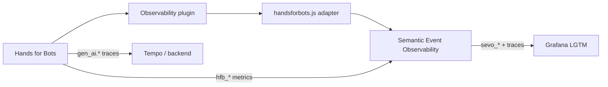

# Hands for Bots roadmap (adapter consumer)

Metrics, phases, and integration work specific to **Hands for Bots** as a consumer of [Semantic Event Observability](./roadmap.md).

> **Library metrics (`sevo_*`):** [metrics-roadmap.md](./metrics-roadmap.md)  
> **Integration guide:** [handsforbots-adapter.md](./handsforbots-adapter.md)

---

## Relationship to the library

Hands for Bots does **not** extend the lib core. It provides:

1. **Adapter preset** — `adapters/handsforbots.js`
2. **Observability output plugin** — `Plugins/Output/Observability/`
3. **Domain metrics** — `hfb_*` via `recordMetric()` and future plugin instrumentation
4. **Phase preset** — `HFB_PHASE_MODEL` in adapter (passed to `createObservability`)
5. **Backend correlation** — trace propagation from orchestrator / backend cores

The adapter and Observability plugin do **not** provide uptime monitoring, health endpoints, or platform probes. Those stay in deploy/infra and backend stacks — see [library scope](./architecture.md#scope).



---

## HfB turn & phase preset

Configured in `adapters/handsforbots.js` and passed to `createObservability`:

```javascript
export const HFB_TURN_START_EVENTS = ['core.input']
export const HFB_TURN_END_EVENTS = ['core.output_ready']

export const HFB_PHASE_MODEL = definePhaseModel([
  {
    id: 'backend',
    startEvent: 'core.calling_backend',
    endEvent: 'core.backend_responded',
  },
  // render: wall-clock after backend_responded until turn.end (lib computes render_ms)
])

export const HFB_SEMANTIC_EVENTS = [ /* allowlist for high-signal events */ ]
```

**State provider (HfB-specific):**

```javascript
{
  queueDepth: bot.orchestrator.queue.length,
  callingBackend: bot.orchestrator.calling_backend,
  redirectInput: bot.redirectInput,
}
```

---

## Metric naming (`hfb_*`)

| Prefix  | Owner |
|---------|-------|
| `hfb_`  | Hands for Bots cores, plugins, adapter |
| `sevo_` | Library only — never defined in HfB code |

**Recommended labels:** `plugin`, `backend`, `modality` (`text` \| `voice`), `environment`.

---

## Development checklist

Status: `[ ]` not started · `[~]` partial · `[x]` done

### P0 — Adapter alignment with lib abstractions

| # | Item | Status |
|---|------|--------|
| H0.1 | Move phase preset from otel exporter to adapter `HFB_PHASE_MODEL` | [x] |
| H0.2 | Wire adapter to `PhaseModel` when lib Phase B ships | [x] |
| H0.3 | Enable Observability plugin in example stack with `sevo_*` validation | [~] |
| H0.4 | Document adapter preset in [handsforbots-adapter.md](./handsforbots-adapter.md) | [~] |

---

### P1 — Orchestration & modality metrics

| # | Metric | Source event | Status |
|---|--------|--------------|--------|
| H1.1 | `hfb_input_total{plugin}` | `core.input` | [ ] |
| H1.2 | `hfb_output_ready_total` | `core.output_ready` | [ ] |
| H1.3 | `hfb_backend_requests_total{backend,status}` | `core.calling_backend` + errors | [ ] |
| H1.4 | Turn labels `input_plugin` on `sevo_*` via adapter metadata | `core.input` payload | [x] |
| H1.5 | `sevo_queue_wait_ms` data — emit via phase or custom span | input → calling_backend | [ ] |
| H1.6 | Backend error → `error.type` on phase span | orchestrator / backend | [ ] |

---

### P2 — UI lifecycle & session

| # | Metric | Source event | Status |
|---|--------|--------------|--------|
| H2.1 | `hfb_bot_load_duration_ms` | `core.loaded` | [ ] |
| H2.2 | `hfb_ui_load_duration_ms{plugin}` | `core.ui_loaded` | [ ] |
| H2.3 | `hfb_all_ui_loaded_total` | `core.all_ui_loaded` | [ ] |
| H2.4 | `hfb_session_renewals_total` | `core.renew_session` | [ ] |
| H2.5 | `hfb_history_cleared_total` | `core.history_cleared` | [ ] |
| H2.6 | `hfb_bc_messages_total` | BroadcastChannel (adapter) | [ ] |
| H2.7 | `hfb_redirect_input_total` | `redirectInput` state | [ ] |
| H2.8 | `hfb_action_success_total{plugin}` | `core.action_success` | [ ] |
| H2.9 | `hfb_mcp_tool_feedback_total` | `mcp.tool_feedback_received` | [ ] |
| H2.10 | Plugin metrics cookbook in docs | `recordMetric()` examples | [ ] |

---

### P2 — Voice (HfB Voice core)

| # | Metric | Source | Status |
|---|--------|--------|--------|
| H2.V1 | `hfb_voice_session_duration_s` | Voice input/output | [ ] |
| H2.V2 | `hfb_voice_stt_duration_ms` | SpeechRecognition / Vosk | [ ] |
| H2.V3 | `hfb_voice_endpoint_delay_ms` | silence → send | [ ] |
| H2.V4 | `hfb_voice_tts_ttfb_ms` | Voice output | [ ] |
| H2.V5 | `hfb_voice_interruptions_total` | barge-in during TTS | [ ] |

Industry targets (voice): mouth-to-ear P95 &lt; 1.1–1.4 s; STT &lt; 500 ms; TTS TTFB &lt; 250 ms ([Twilio guide](https://www.twilio.com/en-us/blog/developers/best-practices/guide-core-latency-ai-voice-agents)).

---

### P3 — Backend integration (HfB cores)

Backend work stays in **BotOrchestrator** and backend cores. The lib provides trace propagation only.

| # | Item | Owner | Status |
|---|------|-------|--------|
| H3.1 | Inject `traceparent` on `sendToBackend` fetch | BotOrchestrator | [ ] |
| H3.2 | `gen_ai.client.operation.duration` | OpenAI / UniversalLLM core | [ ] |
| H3.3 | `gen_ai.client.token.usage` | OpenAI / UniversalLLM core | [ ] |
| H3.4 | MCP / tool execution child spans | MCPHelper | [ ] |
| H3.5 | Rasa backend span or `backend=rasa` label | Rasa core | [ ] |
| H3.6 | End-to-end trace demo in `examples/OBSERVABILITY.md` | Examples | [ ] |
| H3.7 | Backend observability guide | `docs/en-us/` or `docs-dev/` | [ ] |

| Question | `sevo_*` (lib) | `hfb_*` (HfB) | `gen_ai.*` (backend) |
|----------|---------------|---------------|----------------------|
| User wait time | `sevo_turn_duration_ms` | — | — |
| Backend wall time | `sevo_phase_duration_ms{phase="backend"}` | — | `gen_ai.client.operation.duration` |
| Render / speak time | `sevo_phase_duration_ms` or render attr | `hfb_voice_tts_ttfb_ms` | — |
| Input modality | label on seo | `hfb_input_total` | — |
| Token cost | — | — | `gen_ai.client.token.usage` |

---

### P4 — Quality & product (HfB + Langfuse)

| # | Item | Status |
|---|------|--------|
| H4.1 | User feedback plugin linked to `turnId` | [ ] |
| H4.2 | Langfuse project config in Observability plugin | [ ] |
| H4.3 | Online eval sampling on production turns | [ ] |
| H4.4 | Unify or deprecate Analytics plugin vs observability pipeline | [ ] |

---

## Implementation pattern for HfB metrics

Prefer thin instrumentation in cores/plugins; emit via the observability instance:

```javascript
// In a plugin
this.bot.observability?.recordMetric('hfb_gallery_open_total', 1, { plugin: 'ImageGallery' })
```

For automatic bus-driven metrics, a future **HfB metrics helper** (in the adapter, not lib core) may subscribe to `HFB_SEMANTIC_EVENTS` and increment counters — keeps plugins declarative.

---

## Changelog

| Date | Change |
|------|--------|
| 2026-06-15 | H0.1–H0.2 done; `HFB_PHASE_MODEL` in adapter |
