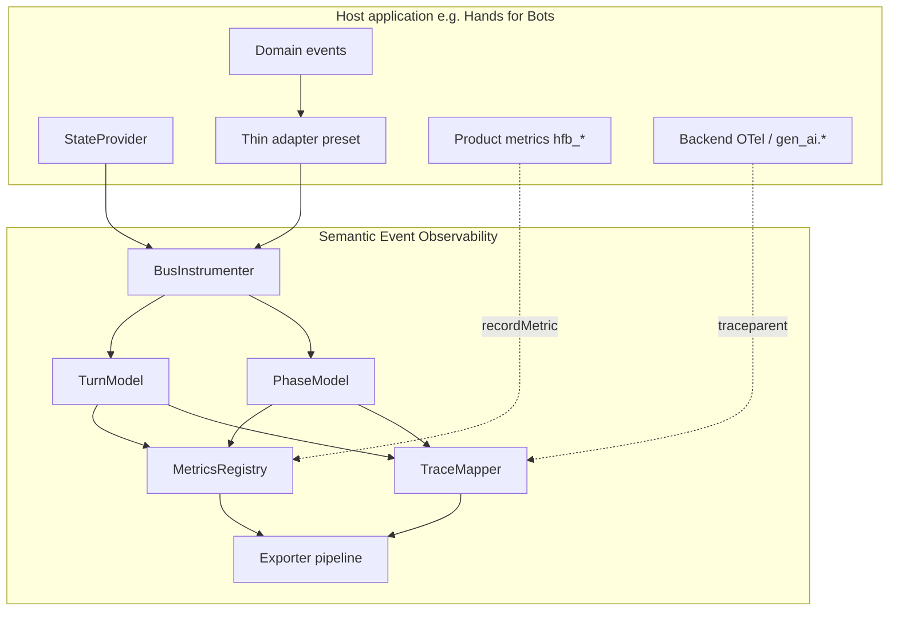

# Library roadmap

Development plan for **Semantic Event Observability** as a **standalone, host-agnostic** front-end library.

> Hands for Bots is one consumer. Its metrics and adapter-specific work live in [handsforbots-roadmap.md](./handsforbots-roadmap.md).

---

## Vision

Offer industry-grade **semantic observability for browser event-driven applications** — chatbots, agent UIs, wizards, games, multi-step flows — without coupling to a specific framework.

**Value proposition for the industry:**

| Problem | What we offer |
|---------|----------------|
| Event buses are invisible in APM | Automatic instrumentation of `on` / `trigger` with correlation |
| User “turns” span many async steps | Configurable turn boundaries + trace trees |
| Front-end latency is a black box | Phase timing (request → response → render) on the client |
| Telemetry must not break the app | Fail-safe exporters, optional peers, policy guardrails |
| Vendor lock-in | OTel, Faro, Langfuse, LangSmith — pluggable exporters |
| LLM observability ignores the UI layer | Client-side turn root span; backend joins via trace context |

**Non-goals (stay out of the lib):**

- Backend LLM SDK instrumentation (`gen_ai.*` — host responsibility)
- Product analytics schemas (`hfb_*` — host adapter responsibility)
- Storing or evaluating prompts at scale (delegate to Langfuse / eval platforms)

---

## Boundary: library vs host



| Concern | Library (`sevo_*`) | Host (`hfb_*`, backend) |
|---------|-------------------|-------------------------|
| Turn start / end detection | Configurable `TurnModel` | Preset event names |
| Phase timing (generic) | `PhaseModel` e.g. `fetch`, `render` | Map events → phase config |
| Bus instrumentation | `instrument()` | Choose which bus |
| Runtime state snapshot | `stateProvider` callback | Return queue depth, etc. |
| Metric names & labels | `sevo_*` only | Host prefix + labels |
| Voice / plugin / modality | — | Host cores & plugins |
| Token usage, LLM latency | Trace correlation hook | Backend instrumentation |
| Grafana dashboard template | Generic turn/phase panels | Host-specific panels optional |

---

## Industry alignment (front-end focus)

Production front-end and agent-UI observability expects:

### Three signals

| Signal | Library role |
|--------|----------------|
| **Traces** | One trace per turn; phase + event child spans |
| **Metrics** | Histograms/counters for turn duration, phases, drops, throughput |
| **Logs** | Semantic events → Faro/Loki (sampled bus traffic) |

### Four measurement layers (client-owned portions)

| Layer | Industry examples | Library coverage |
|-------|-------------------|------------------|
| **Infrastructure** | Load time, JS errors, telemetry health | Policy drops, exporter errors, init timing (host) |
| **Execution** | Stage latency breakdown | Turn + **PhaseModel** durations |
| **Reliability** | Completion rate, errors, queue pressure | Turn completion/abandonment; state gauge from provider |
| **Outcome** | Task success, user feedback | `record()` / exporter only — evals stay external |

### Standards we align with

- **OpenTelemetry** — spans, metrics API, W3C trace context propagation
- **OTel GenAI conventions** — compatible trace IDs; backend children use `gen_ai.*` (not emitted by this lib)
- **Grafana Faro** — browser RUM + custom events
- **Langfuse / LangSmith** — turn-as-run mapping for LLM workflows

References: [OTel AI agent observability](https://opentelemetry.io/blog/2025/ai-agent-observability/), [GenAI metrics](https://hexdocs.pm/opentelemetry_semantic_conventions/gen-ai-metrics.html).

---

## Planned abstractions

Abstractions are ordered by dependency. **Bold** = new or needs extraction from current code.

### 1. Core envelope (exists — stabilize API)

| Abstraction | Module | Responsibility |
|-------------|--------|----------------|
| `SemanticEvent` | `core/createObservability.js` | Canonical fields: `id`, `type`, `name`, `timestamp`, correlation ids, `payloadSummary`, `state`, `durationMs` |
| `CorrelationContext` | `core/CorrelationContext.js` | Session, turn, trace ids; observes bus events |
| `Policy` | `core/Policy.js` | Sample, rate-limit, redact; never sample `turn.*` / `metric.*` |
| `EventBuffer` | `core/EventBuffer.js` | Ring buffer for timeline + debug export |

**Roadmap:** Document schema in [architecture.md](./architecture.md); add TypeScript/JSDoc typedef export.

---

### 2. TurnModel (exists as options — formalize)

Configurable boundaries for a correlated user interaction (conversation turn, wizard step, game round).

```javascript
const turnModel = {
  startEvents: ['user.message'],   // opens turn + new traceId
  endEvents: ['ui.ready'],           // closes turn + durationMs
  onAbandoned: 'count',              // 'count' | 'event' | 'ignore'
}
```

| Method | Purpose |
|--------|---------|
| `observeBusEvent(name)` | Returns `turn.start` / `turn.end` / null |
| `getContext()` | Current `sessionId`, `turnId`, `traceId` |
| `getActiveTurnAge()` | For stuck-turn detection |

**Roadmap:**

- [ ] Extract `TurnModel` from inline `CorrelationContext` options
- [~] Abandoned turn detection (new turn before `endEvents`) — in `CorrelationContext`
- [ ] Optional manual `startTurn()` / `endTurn()` for non-bus flows
- [ ] Export preset factories: `createConversationTurnModel({ start, end })`

---

### 3. PhaseModel (new — replaces hardcoded backend phase)

Declarative phases within a turn. Today `exporters/otel.js` hardcodes `core.calling_backend` → `core.backend_responded`. This moves to configuration.

```javascript
const phaseModel = [
  {
    id: 'remote',
    startEvent: 'api.request',
    endEvent: 'api.response',
    metric: 'sevo_phase_duration_ms',  // label phase=remote
    spanName: 'phase:remote',
  },
  {
    id: 'render',
    startEvent: 'api.response',       // implicit: wall-clock after previous phase
    endEvent: 'ui.painted',
    spanName: 'phase:render',
  },
]
```

| Component | Responsibility |
|-----------|----------------|
| **`PhaseTracker`** | Subscribes to semantic events; starts/ends phases; computes durations |
| **`PhaseState`** | Per-turn open phases, timestamps |
| **Span hints** | Pass `phaseSpan` metadata to TraceMapper |

**Roadmap:**

- [x] `core/PhaseTracker.js` — event-driven phase timing + manual API
- [x] `core/PhaseModel.js` — validate + normalize phase config (`definePhaseModel`)
- [x] `exporters/otel.js` consumes `phase.start` / `phase.end` semantic events via `TraceMapper`
- [x] Manual API: `observability.startPhase(id)` / `endPhase(id)` for non-bus work
- [x] Default: zero phases (turn + events only) for minimal adopters

---

### 4. MetricsRegistry (new — single source of truth)

Central recording for `sevo_*` instruments. Exporters subscribe; no duplicate logic in OTel exporter.

```javascript
// core/MetricsRegistry.js
const instruments = {
  turnDuration: histogram('sevo_turn_duration_ms', { unit: 'ms' }),
  phaseDuration: histogram('sevo_phase_duration_ms', { labels: ['phase'] }),
  turnsTotal: counter('sevo_turns_total', { labels: ['status'] }),
  eventsDropped: counter('sevo_events_dropped_total', { labels: ['reason'] }),
  stateGauge: observableGauge('sevo_state_gauge', { labels: ['key'] }),
}
```

| Rule | Detail |
|------|--------|
| Prefix | Always `sevo_` |
| Recording triggers | `turn.end`, phase end, `Policy.recordDrop()`, periodic state scrape |
| OTel export | Metrics API histograms/counters — **not** one span per metric |
| Host metrics | `recordMetric()` bypasses registry naming or uses `host.` prefix policy |

**Roadmap:** See [metrics-roadmap.md](./metrics-roadmap.md) checklist.

---

### 5. TraceMapper (extract from otel exporter)

Maps semantic events + phase state → OpenTelemetry span tree.

```
turn:<startEvent>                    [root]
├── phase:<id>                       [PhaseModel]
├── event:<busName>                  [each bus.trigger]
└── attributes: turn.duration_ms, phase.*_ms
```

| Concern | Approach |
|---------|----------|
| Error marking | Pluggable `isError(event)` — default heuristic, host override |
| Attributes | `sevo.*` namespace on spans |
| Active context | Set span context on turn root for child manual spans |

**Roadmap:**

- [x] `core/TraceMapper.js` — span lifecycle independent of OTel import
- [x] `exporters/otel.js` — thin adapter over TraceMapper + `otelTraceBackend.js`
- [x] Align span names with OTel incubating `invoke_agent` guidance where applicable

---

### 6. TraceContextBridge (new — backend correlation)

Enables distributed traces: browser turn root + server LLM/tool children.

```javascript
import { getTraceHeaders, withTraceContext } from './core/TraceContextBridge.js'

fetch(url, withTraceContext(observability, { method: 'POST', body }))
// injects traceparent from active turn trace
```

**Roadmap:**

- [x] Read active `traceId` / span context from turn root
- [x] `withTraceContext` / `withFetch` for outbound calls
- [x] Document host integration (no fetch patching inside lib by default)

---

### 7. BusInstrumenter (exists — extend)

| API | Status |
|-----|--------|
| `instrument(bus, { stateProvider, wrapListeners })` | Exists |
| `instrumentEventBus()` | Generic adapter |
| **`instrumentChannel(channel, options)`** | Generic BroadcastChannel / MessagePort helper |
| **`createInstrumentedBus()`** | Bootstrap helper |

**Roadmap:**

- [x] Extract channel instrumentation from HfB adapter into generic `instrumentChannel`
- [x] Optional `eventFilter(name) => boolean` to reduce noise
- [x] `eventAllowlist` mode for high-volume buses

---

### 8. Exporter pipeline (exists — extend)

```javascript
interface Exporter {
  id: string
  available: boolean
  init(context): Promise<void>
  onEvent(event): void
  onMetric(metric): void      // registry reading
  onPhaseEnd?(phase): void    // optional
  destroy(): void
}
```

**Roadmap:**

- [x] `onPhaseEnd` for exporters that need phase granularity
- [ ] Shared `ExporterContext` with MetricsRegistry + TurnModel stats
- [ ] Custom exporter template in docs

---

### 9. Host adapter pattern (thin presets only)

Adapters **configure** the lib; they do not add core logic.

```javascript
// adapters/my-app.js
export function attachMyAppObservability(app, options) {
  return createObservability({
    turnModel: { startEvents: ['app.submit'], endEvents: ['app.rendered'] },
    phases: MY_PHASES,
    stateProvider: () => ({ queue: app.queue.length }),
    exporters: options.exporters,
  }).instrument(app.events, options)
}
```

**Hands for Bots** adapter: [handsforbots-roadmap.md](./handsforbots-roadmap.md).

---

## Public API target (facilitate adoption)

### Minimal (today)

```javascript
import { createObservability, instrumentEventBus, definePhaseModel } from '@handsforbots/semantic-event-observability'

const obs = createObservability({
  turnStartEvents: ['user.message'],
  turnEndEvents: ['bot.response'],
  phases: definePhaseModel([
    { id: 'backend', startEvent: 'api.call', endEvent: 'api.done' },
  ]),
  exporters: ['memory', 'console'],
})
instrumentEventBus(obs, myBus, { stateProvider: () => ({}) })

obs.startPhase('custom-work')  // manual phase within active turn
obs.endPhase('custom-work')
```

### Target (after abstraction work)

```javascript
import {
  createObservability,
  defineTurnModel,
  definePhaseModel,
  instrumentEventBus,
  withTraceContext,
} from '@handsforbots/semantic-event-observability'

const obs = createObservability({
  turn: defineTurnModel({ start: ['user.message'], end: ['bot.response'] }),
  phases: definePhaseModel([
    { id: 'backend', start: 'api.call', end: 'api.done' },
    { id: 'render', end: 'ui.ready' },  // render_ms after last phase end
  ]),
  exporters: ['otel', 'faro'],
  exporterConfig: { otel: { /* injected */ } },
})

instrumentEventBus(obs, bus, { stateProvider })

obs.record('custom.action', { key: 'value' })
obs.recordMetric('cart.add', 1, { sku: 'x' })  // host-named; document convention

await fetch('/api', withTraceContext(obs, { method: 'POST' }))
```

---

## Development phases

Status: `[ ]` not started · `[~]` partial · `[x]` done

### Phase A — Metrics foundation (P0)

| # | Item | Status |
|---|------|--------|
| A.1 | `MetricsRegistry` module | [x] |
| A.2 | Emit `sevo_turn_duration_ms`, `sevo_phase_duration_ms`, `sevo_events_dropped_total` | [x] |
| A.3 | Turn completion / abandonment counters | [x] |
| A.4 | OTel Metrics API export (replace span-per-metric) | [x] |
| A.5 | State gauge from `stateProvider` keys | [x] |
| A.6 | Grafana dashboard validation | [~] |

Details: [metrics-roadmap.md](./metrics-roadmap.md).

### Phase B — PhaseModel & TraceMapper (P1)

| # | Item | Status |
|---|------|--------|
| B.1 | `PhaseTracker` + `PhaseModel` config | [x] |
| B.2 | Extract `TraceMapper` from otel exporter | [x] |
| B.3 | Remove hardcoded `core.calling_backend` from lib core | [x] |
| B.4 | Manual `startPhase` / `endPhase` API | [x] |
| B.5 | `onPhaseEnd` exporter hook | [x] |
| B.6 | Pluggable error detection | [x] |

### Phase C — Correlation & instrumentation (P1)

| # | Item | Status |
|---|------|--------|
| C.1 | Formal `TurnModel` with abandonment | [x] |
| C.2 | `TraceContextBridge` + `withTraceContext` | [x] |
| C.3 | Generic `instrumentChannel` | [x] |
| C.4 | `eventFilter` / allowlist for bus | [x] |
| C.5 | Exporter error metrics | [x] |

### Phase D — DX & packaging (P2)

| # | Item | Status |
|---|------|--------|
| D.1 | TypeScript types or `.d.ts` for public API | [x] |
| D.2 | `defineTurnModel` / `definePhaseModel` helpers | [x] |
| D.3 | Custom exporter cookbook | [x] |
| D.4 | Framework-agnostic getting started (non-HfB) | [x] |
| D.5 | npm publish from `packageIdentity.js` | [~] |
| D.6 | Integration test harness (memory exporter) | [x] |

### Phase E — Industry depth (P2–P3)

| # | Item | Status |
|---|------|--------|
| E.1 | OTel `invoke_agent` span naming option on turn root | [x] |
| E.2 | Tail sampling guidance doc | [x] |
| E.3 | Langfuse/LangSmith phase-aware mapping | [x] |
| E.4 | Web Vitals bridge (optional exporter) | [x] |
| E.5 | Session-level rollup metrics (`sevo_session_turns_total`) | [x] |

---

## What hosts must still provide

| Need | Owner |
|------|-------|
| Domain event names | Host app |
| Phase presets for domain | Host adapter |
| `gen_ai.*` metrics | Backend / BFF |
| Product analytics (`hfb_*`) | Host plugins |
| Eval scores | Langfuse / custom |
| Collector auth & sampling | Ops / platform |

---

## Related documents

| Document | Scope |
|----------|-------|
| [metrics-roadmap.md](./metrics-roadmap.md) | `sevo_*` metrics checklist (lib only) |
| [handsforbots-roadmap.md](./handsforbots-roadmap.md) | Hands for Bots adapter & `hfb_*` metrics |
| [architecture.md](./architecture.md) | Current runtime design |
| [exporters.md](./exporters.md) | Exporter interface |
| [handsforbots-adapter.md](./handsforbots-adapter.md) | HfB integration guide |

---

## Changelog

| Date | Change |
|------|--------|
| 2026-06-15 | Initial library roadmap; split from combined metrics doc |
| 2026-06-15 | Phase B: PhaseTracker, TraceMapper, phase semantic events, manual API, onPhaseEnd hook |
